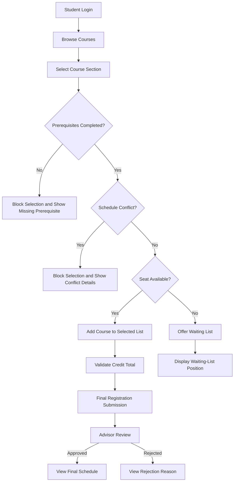

# CoursePilot

CoursePilot is a web-based course registration and waitlist management system designed to make university course registration clearer, more reliable, and easier to manage.

The system helps students browse available course sections, verify prerequisites, monitor credit limits, avoid schedule conflicts, join waiting lists for full sections, track registration status, and view their approved class schedules.

## Project Overview

Existing course-registration systems may display outdated seat availability, provide limited prerequisite information, and make it difficult for students to track selected class times. When a section becomes full, students may also lack a structured method for requesting a seat.

CoursePilot addresses these problems through real-time seat verification, automated registration validation, structured waiting lists, advisor approval, and clear registration-status tracking.

## Main Features

### Student Features

* Secure student login
* Course and section browsing
* Course search and filtering
* Course-detail viewing
* Current seat-availability display
* Seat revalidation during confirmation
* Mandatory-course identification
* Prerequisite checking
* Missing-prerequisite explanations
* Instant selected-credit calculation
* Minimum and maximum credit validation
* Schedule-conflict detection
* Detailed conflict information
* Final-submission validation
* Waiting-list enrollment
* Waiting-list position tracking
* Registration-status tracking
* Advisor comments and rejection reasons
* Approved-course list
* Weekly class timetable
* Course-drop support

### Academic Advisor Features

* View assigned students
* Review pending registration requests
* View selected courses and total credits
* Review prerequisite and conflict results
* Approve registration requests
* Reject requests with reasons
* Add advisor comments
* View decision history

### Department Administrator Features

* Create and update courses
* Create and update course sections
* Assign instructors
* Assign rooms and class schedules
* Configure section capacities
* Define course prerequisites
* Mark courses as mandatory or elective
* Manage registration periods
* Monitor enrollment and waiting lists

### System Administrator Features

* Manage user accounts
* Assign user roles
* Activate or deactivate accounts
* Enforce role-based access
* View system activities
* Review audit logs

## Intended Users

* Students
* Academic advisors
* Department administrators
* System administrators

## Proposed Technology Stack

| Layer              | Technology           |
| ------------------ | -------------------- |
| Frontend           | React and TypeScript |
| Build Tool         | Vite                 |
| Backend            | FastAPI and Python   |
| Database           | PostgreSQL           |
| ORM                | SQLAlchemy           |
| Validation         | Pydantic             |
| Authentication     | JSON Web Token       |
| API Style          | REST API             |
| API Documentation  | OpenAPI and Swagger  |
| Version Control    | Git and GitHub       |
| Deployment Support | Docker               |

## System Architecture

CoursePilot follows a three-tier web architecture:

1. **Presentation layer:** React and TypeScript frontend
2. **Application layer:** FastAPI REST API and business services
3. **Data layer:** PostgreSQL database through SQLAlchemy

The backend manages registration rules such as prerequisite validation, credit-limit checking, schedule-conflict detection, seat allocation, waiting-list ordering, and advisor approval.

## Project Documentation

### Business Analysis

1. [Project Overview](docs/01-project-overview.md)
2. [Problem Statement](docs/02-problem-statement.md)
3. [Stakeholder Analysis](docs/03-stakeholder-analysis.md)
4. [Information Gathering](docs/04-information-gathering.md)
5. [Interview Findings](docs/05-interviews.md)
6. [Survey Findings](docs/06-surveys.md)

### Product Requirements Document

1. [Product Requirements Document](docs/08-prd.md)
2. [User Personas](docs/09-user-personas.md)
3. [User Journey](docs/10-user-journey.md)
4. [User Stories](docs/11-user-stories.md)
5. [Acceptance Criteria](docs/12-acceptance-criteria.md)

### Software Requirements Specification

1. [Functional Requirements](docs/13-functional-requirements.md)
2. [Non-Functional Requirements](docs/14-non-functional-requirements.md)
3. [Use Cases](docs/15-use-cases.md)
4. [Data Flow Diagrams](docs/16-dfd.md)
5. [Software Requirements Specification](docs/17-srs.md)

### Technical Design Document

1. [Entity Relationship Diagram](docs/18-erd.md)
2. [System Design](docs/19-system-design.md)
3. [Technical Design Document](docs/20-tdd.md)
4. [Database Design](docs/21-database-design.md)
5. [REST API Design](docs/22-api-design.md)

## Core Registration Workflow



## Repository Structure

```text
CourseReg-wa/
├── docs/
│   ├── 01-project-overview.md
│   ├── 02-problem-statement.md
│   ├── 03-stakeholder-analysis.md
│   ├── 04-information-gathering.md
│   ├── 05-interviews.md
│   ├── 06-surveys.md
│   ├── 08-prd.md
│   ├── 09-user-personas.md
│   ├── 10-user-journey.md
│   ├── 11-user-stories.md
│   ├── 12-acceptance-criteria.md
│   ├── 13-functional-requirements.md
│   ├── 14-non-functional-requirements.md
│   ├── 15-use-cases.md
│   ├── 16-dfd.md
│   ├── 17-srs.md
│   ├── 18-erd.md
│   ├── 19-system-design.md
│   ├── 20-tdd.md
│   ├── 21-database-design.md
│   └── 22-api-design.md
└── README.md
```

## Project Management

CoursePilot is managed through GitHub Issues and a GitHub Project board.

* [GitHub Issues](https://github.com/SS-Munna/CourseReg-wa/issues)
* [GitHub Projects](https://github.com/SS-Munna/CourseReg-wa/projects)
* [CoursePilot Repository](https://github.com/SS-Munna/CourseReg-wa)

The repository contains two categories of issues:

### Planning and Documentation Issues

The original planning issues cover:

1. Business Analysis
2. Product Requirements Document
3. Software Requirements Specification
4. Technical Design Document

These issues represent the requirement gathering, analysis, and technical design completed before implementation.

### Development and Implementation Issues

The implementation backlog contains tasks for:

* Frontend and backend setup
* PostgreSQL and SQLAlchemy configuration
* Database migrations
* Authentication and JWT handling
* Role-based access control
* Course and section APIs
* Course search and filtering
* Prerequisite validation
* Credit calculation and validation
* Schedule-conflict detection
* Safe seat allocation
* Final registration submission
* Waiting-list management
* Advisor approval and rejection
* Registration-status tracking
* Weekly timetable
* Department administration
* Notifications and audit logs
* Automated testing
* Docker and continuous integration
* Security review and regression testing

The CoursePilot Project Board organizes tasks using:

* Backlog
* In Progress
* Done

Most implementation tasks remain in the Backlog until development begins. Only actively developed tasks should be moved to In Progress.


## Requirement Traceability

The official functional requirement identifiers are defined in:

[Functional Requirements — FR-001 to FR-100](docs/13-functional-requirements.md)

These identifiers are used consistently in the SRS, Technical Design Document, database design, and REST API design.

## Research and Requirement Gathering

The CoursePilot requirements were developed using:

* Stakeholder analysis
* Student interviews
* Online survey
* Existing registration-system observation
* Functional and non-functional requirement analysis
* User stories and acceptance criteria
* Use cases and Data Flow Diagrams

## Project Status

The following project documentation has been completed:

* Business Analysis
* Product Requirements Document
* Software Requirements Specification
* Technical Design Document
* Entity Relationship Diagram
* Database Design
* REST API Design

The survey findings have been finalized and incorporated into the business-analysis documentation.

CoursePilot is now ready to move from planning and technical design into implementation. Development tasks have been created and organized through GitHub Issues and the CoursePilot Project Board.


## Project Owner

**SS-Munna**

This is an individual academic project managed through GitHub Issues, commits, documentation, and a Kanban board.
