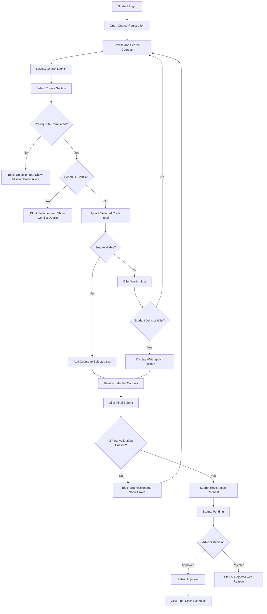

# CoursePilot User Journey

## 1. Introduction

This document describes how the main users interact with CoursePilot from the beginning of the course-registration process until the final registration outcome.

The primary user journey focuses on the student because students perform the main registration activities. Separate journeys are also included for academic advisors and department administrators.

---

## 2. Primary Student Journey

### 2.1 User

**Student**

### 2.2 Main Goal

The student wants to register for eligible courses, avoid schedule conflicts, satisfy credit requirements, join a waiting list when necessary, and view the final approved class schedule.

### 2.3 Preconditions

Before starting the journey:

* The student has an active university account.
* The registration period is open.
* Courses and sections have already been created.
* Seat capacities, schedules, rooms, instructors, and prerequisites are available.
* The student's completed-course records are available.
* Minimum and maximum credit limits are configured.

---

## 3. Student Journey Stages

### Stage 1: Login

#### Student Action

The student enters a valid university ID or email address and password.

#### System Response

The system:

* Verifies the credentials.
* Identifies the user as a student.
* Opens the student dashboard.
* Displays the current registration period.

#### Possible Problem

The student may enter invalid credentials.

#### CoursePilot Improvement

The system displays a clear error message and allows the student to try again.

---

### Stage 2: Open Course Registration

#### Student Action

The student selects the course-registration option from the dashboard.

#### System Response

The system displays:

* Available courses
* Course codes and titles
* Sections
* Instructors
* Credits
* Class days and times
* Room numbers
* Available seats
* Prerequisites
* Mandatory-course labels

#### Student Expectation

The information should be easy to search and understand.

---

### Stage 3: Search and Filter Courses

#### Student Action

The student searches for a course using its code or title.

The student may also filter courses by:

* Department
* Trimester
* Course level
* Available seats
* Mandatory or elective status

#### System Response

The system displays matching courses and sections.

It also shows the student's already selected courses and their class times so the student does not need to remember or write them down separately.

---

### Stage 4: Review Course Details

#### Student Action

The student opens a course section to review its details.

#### System Response

The system displays:

* Course code
* Course title
* Credit value
* Section
* Instructor
* Class day
* Start and end time
* Room number
* Total seat capacity
* Available seats
* Required prerequisites
* Mandatory or elective status

#### Possible Problem

The displayed seat count may change while other students are registering.

#### CoursePilot Improvement

The seat count updates automatically, and the system verifies availability again during confirmation.

---

### Stage 5: Select a Course Section

#### Student Action

The student clicks the option to select a course section.

#### System Response

The system begins automatic validation.

The validation includes:

1. Duplicate-course checking
2. Completed-course checking
3. Prerequisite checking
4. Schedule-conflict checking
5. Seat-availability checking
6. Credit-total calculation

---

## 4. Validation Journey

### 4.1 Prerequisite Validation

#### Condition

The selected course requires one or more prerequisite courses.

#### System Response

The system checks the student's completed-course records.

#### Successful Result

If all prerequisites are complete, the student may continue.

#### Failed Result

If a prerequisite is missing, the system blocks the selection and displays:

* Required prerequisite course
* Missing course code
* Explanation of why registration is not allowed

#### Example Message

> Registration blocked. CSE 201 must be completed before registering for CSE 301.

---

### 4.2 Schedule-Conflict Validation

#### Condition

The selected section overlaps with an already selected or registered course.

#### System Response

The system blocks the conflicting selection or final submission.

It displays:

* Selected course code and section
* Conflicting course code and section
* Day
* Start time
* End time
* Suggested action

#### Example Message

> Schedule conflict detected. CSE 301, Section 2 overlaps with CSE 305, Section 1 on Sunday from 10:00 AM to 11:30 AM. Please select another section.

#### User Benefit

The student does not need to remember or manually write down the schedules of previously selected courses.

---

### 4.3 Credit Validation

#### Student Action

The student adds or removes courses.

#### System Response

The system updates the selected-credit total instantly.

It displays:

* Current selected credits
* Minimum required credits
* Maximum allowed credits

#### Failed Result

The system blocks final submission when:

* The selected credit total is below the minimum requirement.
* The selected credit total exceeds the maximum limit.

#### Example Message

> Final submission blocked. You have selected 6 credits, but the minimum requirement is 9 credits.

---

### 4.4 Seat-Availability Validation

#### Condition 1: Seat Available

The system temporarily confirms that a seat is available.

The course is added to the student's selected-course list.

#### Condition 2: Section Full

The system informs the student that no direct seat is available.

The student is offered the option to join the waiting list.

#### Important Rule

The system checks the seat again when the student confirms registration, preventing outdated seat information from causing incorrect enrollment.

---

## 5. Waiting-List Journey

### Stage 1: Join Waiting List

#### Student Action

The student clicks **Join Waiting List**.

#### System Response

The system:

* Confirms prerequisite eligibility.
* Confirms that no schedule conflict exists.
* Adds the student to the queue.
* Records the joining date and time.
* Displays the current waiting-list position.

### Stage 2: Monitor Waiting-List Position

#### Student Action

The student opens the waiting-list section of the portal.

#### System Response

The system displays:

* Course code
* Course title
* Section
* Current position
* Total students waiting
* Waiting-list status

### Stage 3: Seat Becomes Available

When a student drops the course or the seat capacity increases, the first eligible student on the waiting list is considered.

The student's status may change from:

```text
Waitlisted → Pending Approval
```

or:

```text
Waitlisted → Approved
```

depending on the university's registration policy.

### Stage 4: Notification

The student receives an in-system notification that a seat has become available or that the waiting-list status has changed.

---

## 6. Final Submission Journey

### Stage 1: Review Selected Courses

Before submission, the student reviews:

* Selected courses
* Sections
* Credits
* Class schedules
* Available seats
* Prerequisite status
* Conflict status

### Stage 2: Final Validation

When the student clicks **Final Submit**, the system checks all registration rules again.

The final validation includes:

* Prerequisites
* Minimum credit requirement
* Maximum credit limit
* Schedule conflicts
* Duplicate courses
* Seat availability
* Registration-period status

### Stage 3: Submission Outcome

#### Successful Submission

If all checks pass, the registration request is submitted.

The status becomes:

```text
Pending
```

#### Blocked Submission

If any rule fails, submission is blocked.

The system clearly explains:

* What caused the problem
* Which course is affected
* What action the student should take

---

## 7. Advisor Approval Journey

### Stage 1: Advisor Login

The academic advisor logs into the advisor portal.

### Stage 2: View Pending Requests

The advisor views a list of pending student registrations.

The list includes:

* Student ID
* Student name
* Selected courses
* Total credits
* Prerequisite results
* Conflict results
* Waiting-list information

### Stage 3: Review Request

The advisor checks the student's academic eligibility.

### Stage 4: Make Decision

The advisor may:

* Approve the request
* Reject the request
* Add a comment
* Request that the student modify the selection

### Stage 5: Student Notification

The student sees the updated status:

```text
Approved
```

or:

```text
Rejected
```

If rejected, the student also sees the reason.

---

## 8. Final Schedule Journey

### Student Action

The student opens the registered-course schedule after approval.

### System Response

The system displays:

* Course code
* Course title
* Section
* Instructor
* Class day
* Start time
* End time
* Room number
* Credit value
* Registration status

The student may view the schedule in:

* List format
* Weekly timetable format

---

## 9. Student Journey Flow



---

## 10. User Journey Summary

| Stage    | Student Goal               | Main System Support                       |
| -------- | -------------------------- | ----------------------------------------- |
| Login    | Access the portal          | Secure authentication                     |
| Browse   | Find suitable courses      | Search, filters, and course details       |
| Select   | Choose a section           | Eligibility and seat validation           |
| Validate | Avoid invalid registration | Prerequisite, credit, and conflict checks |
| Waitlist | Request a full course      | Queue position and status tracking        |
| Submit   | Complete registration      | Final business-rule validation            |
| Approval | Receive advisor decision   | Pending, approved, or rejected status     |
| Schedule | View registered classes    | Complete weekly timetable                 |

---

## 11. Pain Points and CoursePilot Improvements

| Existing Pain Point                                 | CoursePilot Improvement                                 |
| --------------------------------------------------- | ------------------------------------------------------- |
| Seat count becomes outdated                         | Automatic seat updates and confirmation-time validation |
| Students compete for seat increases                 | Structured waiting-list system                          |
| Waiting-list position is unclear                    | Visible queue position                                  |
| Prerequisites are not clearly shown                 | Prerequisites displayed before selection                |
| Mandatory courses are unclear                       | Mandatory-course labels                                 |
| Selected credit count is unclear                    | Instant credit calculation                              |
| Selected course schedules are difficult to remember | Selected schedule displayed during course search        |
| Conflict messages provide limited context           | Detailed conflicting-course information                 |
| Approval status is unclear                          | Status tracking and advisor comments                    |
| Final schedule is difficult to review               | Weekly timetable and complete course details            |

## 12. Conclusion

The CoursePilot user journey is designed to make course registration transparent, accurate, and easy to follow.

The system supports students from initial login through course selection, validation, waiting-list management, final submission, advisor approval, and final schedule viewing.

This journey will guide the development of user stories, acceptance criteria, use cases, functional requirements, and technical workflows.
