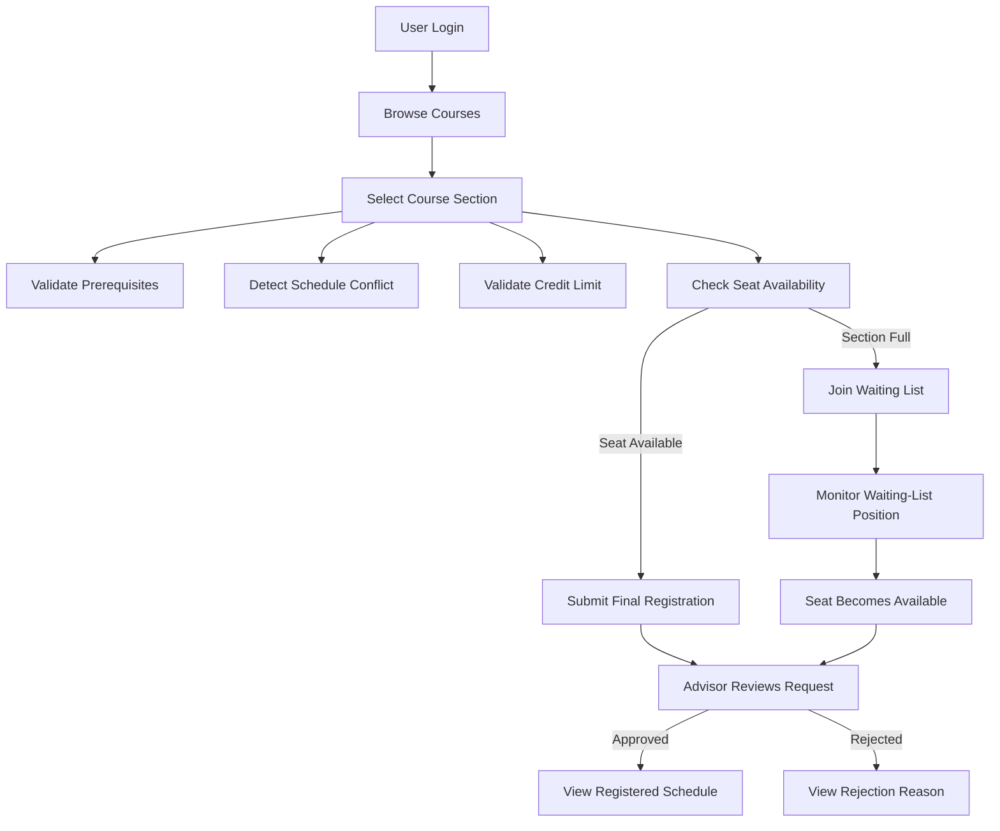

# CoursePilot Use Cases

## 1. Introduction

This document describes the main interactions between CoursePilot users and the system.

Each use case includes:

* Use case ID
* Use case name
* Primary actor
* Preconditions
* Trigger
* Main success flow
* Alternative flows
* Postconditions
* Related requirements

---

# 2. Use Case Summary

| Use Case ID | Use Case Name                  | Primary Actor                   |
| ----------- | ------------------------------ | ------------------------------- |
| UC-001      | User Login                     | Student, Advisor, Administrator |
| UC-002      | Browse and Search Courses      | Student                         |
| UC-003      | Select Course Section          | Student                         |
| UC-004      | Validate Prerequisites         | Student                         |
| UC-005      | Detect Schedule Conflict       | Student                         |
| UC-006      | Validate Credit Limit          | Student                         |
| UC-007      | Join Waiting List              | Student                         |
| UC-008      | Submit Final Registration      | Student                         |
| UC-009      | Review Registration Request    | Academic Advisor                |
| UC-010      | View Registration Status       | Student                         |
| UC-011      | View Registered Schedule       | Student                         |
| UC-012      | Manage Courses and Sections    | Department Administrator        |
| UC-013      | Manage Waiting List            | Department Administrator        |
| UC-014      | Drop Registered Course         | Student                         |
| UC-015      | Manage User Accounts and Roles | System Administrator            |

---

# 3. Detailed Use Cases

## UC-001: User Login

### Primary Actor

Student, academic advisor, department administrator, or system administrator

### Goal

The user wants to access the system according to their assigned role.

### Preconditions

* The user has an active account.
* The system is available.

### Trigger

The user opens the login page.

### Main Success Flow

1. The user enters a valid email address or university ID.
2. The user enters the correct password.
3. The user clicks **Login**.
4. The system validates the credentials.
5. The system identifies the user's role.
6. The system creates an authenticated session.
7. The system redirects the user to the appropriate dashboard.

### Alternative Flows

#### A1: Invalid Credentials

1. The user enters an incorrect email, ID, or password.
2. The system rejects the login attempt.
3. The system displays an error message.
4. The user may try again.

#### A2: Inactive Account

1. The user enters valid credentials.
2. The system detects that the account is inactive.
3. The system denies access.
4. The system displays an account-status message.

### Postconditions

* The user is authenticated.
* The user can access features permitted for their role.

### Related Requirements

* FR-001
* FR-002
* FR-004
* FR-005

---

## UC-002: Browse and Search Courses

### Primary Actor

Student

### Goal

The student wants to find suitable courses and sections.

### Preconditions

* The student is logged in.
* Courses and sections exist.
* The registration period is configured.

### Trigger

The student opens the course-registration page.

### Main Success Flow

1. The system displays available courses and sections.
2. The student searches by course code or title.
3. The student may apply filters.
4. The system displays matching results.
5. The student opens a course section.
6. The system displays:

   * Course code
   * Course title
   * Credit
   * Section
   * Instructor
   * Class day and time
   * Room number
   * Available seats
   * Prerequisites
   * Mandatory or elective status
7. The student reviews the information.

### Alternative Flows

#### A1: No Matching Course

1. The student enters a search term.
2. No matching course exists.
3. The system displays a no-results message.

#### A2: Registration Period Closed

1. The student opens the registration page.
2. The registration period is closed.
3. The system allows course viewing but disables registration actions.

### Postconditions

* The student understands the available course options.
* No registration record is created.

### Related Requirements

* FR-007
* FR-009
* FR-010
* FR-011
* FR-012
* FR-013

---

## UC-003: Select Course Section

### Primary Actor

Student

### Goal

The student wants to add a course section to the selected-course list.

### Preconditions

* The student is logged in.
* The registration period is open.
* The course section exists.

### Trigger

The student clicks **Select Course**.

### Main Success Flow

1. The student selects a course section.
2. The system checks for duplicate selection.
3. The system checks whether the course was previously passed.
4. The system checks prerequisites.
5. The system checks schedule conflicts.
6. The system recalculates selected credits.
7. The system checks seat availability.
8. The course is added to the selected-course list.
9. The updated selected-credit total is displayed.

### Alternative Flows

#### A1: Duplicate Course

1. The student selects a course already present in the list.
2. The system blocks the duplicate selection.
3. The system displays a message.

#### A2: Previously Completed Course

1. The student selects a previously passed course.
2. No retake permission exists.
3. The system blocks the selection.

#### A3: Missing Prerequisite

1. The prerequisite check fails.
2. The system blocks the selection.
3. The missing prerequisite is displayed.

#### A4: Schedule Conflict

1. The selected section overlaps with another selected or approved section.
2. The system blocks the selection.
3. Conflict details are displayed.

#### A5: Section Full

1. No direct seat is available.
2. The system offers the waiting-list option.

### Postconditions

* The course is added to the selected list, or
* The student receives a clear reason why selection was blocked.

### Related Requirements

* FR-019
* FR-020
* FR-022
* FR-023
* FR-025
* FR-026
* FR-035
* FR-038

---

## UC-004: Validate Prerequisites

### Primary Actor

Student

### Supporting Actor

CoursePilot system

### Goal

The system determines whether the student is academically eligible for a course.

### Preconditions

* The selected course has prerequisite rules.
* The student's completed-course records are available.

### Trigger

The student attempts to select a course.

### Main Success Flow

1. The system retrieves the course prerequisites.
2. The system retrieves the student's completed courses.
3. The system compares both records.
4. All required prerequisites are found.
5. The validation passes.
6. The student may continue registration.

### Alternative Flow

#### A1: Missing Prerequisite

1. One or more prerequisites are not found.
2. The validation fails.
3. The system blocks course selection.
4. The system displays the missing course code and title.

### Postconditions

* The course is marked eligible, or
* Registration is blocked due to missing prerequisites.

### Related Requirements

* FR-025
* FR-026
* FR-027
* FR-028

---

## UC-005: Detect Schedule Conflict

### Primary Actor

Student

### Supporting Actor

CoursePilot system

### Goal

The system prevents the student from creating an overlapping class schedule.

### Preconditions

* The student has one or more selected or approved courses.
* The selected course has a valid schedule.

### Trigger

The student selects a new course section or clicks Final Submit.

### Main Success Flow

1. The system retrieves the new course schedule.
2. The system retrieves all selected and approved course schedules.
3. The system compares class days.
4. For matching days, the system compares start and end times.
5. No overlap is detected.
6. The student may continue.

### Alternative Flow

#### A1: Conflict Detected

1. Two classes occur on the same day.
2. Their time ranges overlap.
3. The system blocks the selection or final submission.
4. The system displays:

   * Both course codes
   * Both sections
   * Day
   * Start and end times
5. The student is instructed to remove one course or select another section.

### Postconditions

* The student's selected schedule remains conflict-free.

### Related Requirements

* FR-035
* FR-036
* FR-037
* FR-038
* FR-039
* FR-040

---

## UC-006: Validate Credit Limit

### Primary Actor

Student

### Goal

The student wants to satisfy the minimum and maximum semester credit rules.

### Preconditions

* The student has selected one or more courses.
* Credit limits are configured.

### Trigger

The student adds or removes a course or clicks Final Submit.

### Main Success Flow

1. The system calculates the total selected credits.
2. The system compares the total with the minimum requirement.
3. The system compares the total with the maximum limit.
4. The total is within the allowed range.
5. The validation passes.

### Alternative Flows

#### A1: Below Minimum

1. The total is below the minimum requirement.
2. The system blocks final submission.
3. The system displays the current and required credit values.

#### A2: Above Maximum

1. The total exceeds the maximum limit.
2. The system blocks final submission.
3. The system displays the current and maximum credit values.

### Postconditions

* The credit total is validated.
* Invalid final submission is prevented.

### Related Requirements

* FR-029
* FR-030
* FR-031
* FR-032
* FR-033
* FR-034

---

## UC-007: Join Waiting List

### Primary Actor

Student

### Goal

The student wants to request a seat in a full course section.

### Preconditions

* The student is logged in.
* The section is full.
* The registration period is open.
* The student satisfies prerequisite and schedule rules.
* The student is not already on the waiting list.

### Trigger

The student clicks **Join Waiting List**.

### Main Success Flow

1. The system checks student eligibility.
2. The system confirms that the section is full.
3. The system records the joining date and time.
4. The system creates a waiting-list entry.
5. The system calculates the queue position.
6. The system displays the waiting-list position.
7. The registration status becomes Waitlisted.

### Alternative Flows

#### A1: Duplicate Waiting-List Entry

1. The student is already on the waiting list.
2. The system blocks the duplicate request.

#### A2: Eligibility Check Fails

1. The student has a missing prerequisite or schedule conflict.
2. The system rejects the waiting-list request.
3. The system displays the reason.

#### A3: Seat Becomes Available Before Submission

1. A seat becomes available.
2. The system offers direct registration instead of waiting-list placement.

### Postconditions

* The student is added to the waiting list.
* A queue position is assigned.

### Related Requirements

* FR-041
* FR-042
* FR-043
* FR-044
* FR-046

---

## UC-008: Submit Final Registration

### Primary Actor

Student

### Goal

The student wants to submit the final course-registration request.

### Preconditions

* The student is logged in.
* The registration period is open.
* At least one course is selected.

### Trigger

The student clicks **Final Submit**.

### Main Success Flow

1. The system displays the registration summary.
2. The student reviews selected courses.
3. The student confirms submission.
4. The system validates:

   * Registration period
   * Prerequisites
   * Credit limits
   * Schedule conflicts
   * Duplicate courses
   * Completed-course restrictions
   * Seat availability
5. All validations pass.
6. The system creates the registration request.
7. The status becomes Pending.
8. The system displays a successful submission message.

### Alternative Flows

#### A1: Schedule Conflict

1. A conflict exists.
2. Final submission is blocked.
3. The conflicting courses are displayed.

#### A2: Credit Rule Violation

1. The selected credit total is invalid.
2. Final submission is blocked.
3. The required correction is displayed.

#### A3: Seat No Longer Available

1. A seat was taken before confirmation.
2. Direct enrollment is blocked.
3. The system offers the waiting-list option.

#### A4: Registration Period Closed

1. The registration period closes before submission.
2. The system blocks submission.

### Postconditions

* A valid registration request is created with Pending status, or
* Submission is blocked with clear validation messages.

### Related Requirements

* FR-051
* FR-052
* FR-053
* FR-054
* FR-055
* FR-056
* FR-057

---

## UC-009: Review Registration Request

### Primary Actor

Academic Advisor

### Goal

The advisor wants to approve or reject a student's registration request.

### Preconditions

* The advisor is logged in.
* A pending request exists.
* The student is assigned to the advisor.

### Trigger

The advisor opens a pending registration request.

### Main Success Flow

1. The advisor views the student's registration request.
2. The system displays:

   * Student information
   * Selected courses
   * Total credits
   * Prerequisite results
   * Schedule-conflict results
   * Waiting-list information
3. The advisor reviews the request.
4. The advisor clicks **Approve**.
5. The system changes the status to Approved.
6. The system records the advisor and decision time.
7. The student is notified.

### Alternative Flow

#### A1: Advisor Rejects Request

1. The advisor clicks **Reject**.
2. The system requires a rejection reason.
3. The advisor enters the reason.
4. The system changes the status to Rejected.
5. The student is notified.

### Postconditions

* The request is Approved or Rejected.
* The decision is stored in the registration history.

### Related Requirements

* FR-064
* FR-065
* FR-066
* FR-067
* FR-068
* FR-069
* FR-070

---

## UC-010: View Registration Status

### Primary Actor

Student

### Goal

The student wants to monitor registration outcomes.

### Preconditions

* The student is logged in.
* At least one registration or waiting-list record exists.

### Trigger

The student opens the registration-status page.

### Main Success Flow

1. The system retrieves the student's records.
2. The system displays each course and its current status.
3. Possible statuses include:

   * Draft
   * Pending
   * Approved
   * Rejected
   * Waitlisted
   * Dropped
4. If rejected, the reason is displayed.
5. If waitlisted, the queue position is displayed.

### Postconditions

* The student understands the current state of each registration.

### Related Requirements

* FR-058
* FR-059
* FR-060

---

## UC-011: View Registered Schedule

### Primary Actor

Student

### Goal

The student wants to see the final approved class schedule.

### Preconditions

* The student is logged in.
* At least one course has Approved status.

### Trigger

The student opens the schedule page.

### Main Success Flow

1. The system retrieves all approved courses.
2. The system displays:

   * Course code
   * Course title
   * Section
   * Instructor
   * Class day
   * Start time
   * End time
   * Room number
   * Credit
   * Status
3. The student may switch between list view and weekly timetable view.

### Alternative Flow

#### A1: No Approved Courses

1. No approved course exists.
2. The system displays an empty-schedule message.

### Postconditions

* The student can view and understand the approved class schedule.

### Related Requirements

* FR-085
* FR-086
* FR-087
* FR-088

---

## UC-012: Manage Courses and Sections

### Primary Actor

Department Administrator

### Goal

The administrator wants to configure course offerings.

### Preconditions

* The administrator is logged in.
* The administrator has the required permissions.

### Trigger

The administrator opens the course-management page.

### Main Success Flow

1. The administrator creates or selects a course.
2. The administrator enters or updates course information.
3. The administrator creates a section.
4. The administrator assigns:

   * Instructor
   * Room
   * Class day
   * Start time
   * End time
   * Seat capacity
5. The administrator defines prerequisites.
6. The administrator marks the course as mandatory or elective.
7. The system validates the information.
8. The system saves the course and section.

### Alternative Flows

#### A1: Invalid Capacity

1. The administrator enters zero or a negative number.
2. The system rejects the value.

#### A2: Invalid Schedule

1. The end time is earlier than or equal to the start time.
2. The system blocks the save operation.

#### A3: Missing Required Information

1. One or more required fields are empty.
2. The system displays validation messages.

### Postconditions

* The course and section are available for registration.

### Related Requirements

* FR-071
* FR-072
* FR-073
* FR-074
* FR-075
* FR-076
* FR-077
* FR-078
* FR-079
* FR-080

---

## UC-013: Manage Waiting List

### Primary Actor

Department Administrator

### Goal

The administrator wants to monitor and manage demand for full sections.

### Preconditions

* The administrator is logged in.
* At least one waiting-list entry exists.

### Trigger

The administrator opens the waiting-list management page.

### Main Success Flow

1. The administrator selects a course section.
2. The system displays the ordered waiting list.
3. The system shows:

   * Student ID
   * Student name
   * Queue position
   * Join date and time
   * Eligibility status
4. A seat becomes available.
5. The system identifies the first eligible student.
6. The student is promoted according to policy.
7. Remaining queue positions are updated.

### Alternative Flow

#### A1: First Student Is No Longer Eligible

1. The first student fails an eligibility check.
2. The system skips or flags the entry.
3. The next eligible student is considered.

### Postconditions

* The waiting list remains correctly ordered.
* Available seats are assigned fairly.

### Related Requirements

* FR-043
* FR-048
* FR-049
* FR-050
* FR-082
* FR-084

---

## UC-014: Drop Registered Course

### Primary Actor

Student

### Goal

The student wants to remove an eligible registered course.

### Preconditions

* The student is logged in.
* The course is approved.
* The drop deadline has not passed.

### Trigger

The student clicks **Drop Course**.

### Main Success Flow

1. The student selects an approved course.
2. The system displays a confirmation message.
3. The student confirms the action.
4. The system changes the registration status to Dropped.
5. The enrolled seat count is reduced.
6. The system updates available seats.
7. The system processes the waiting list.
8. The student's schedule is updated.

### Alternative Flow

#### A1: Drop Deadline Passed

1. The student attempts to drop after the deadline.
2. The system blocks the request.

### Postconditions

* The course is removed from the active schedule.
* A seat becomes available.

### Related Requirements

* FR-061
* FR-015
* FR-049

---

## UC-015: Manage User Accounts and Roles

### Primary Actor

System Administrator

### Goal

The administrator wants to control system access.

### Preconditions

* The system administrator is logged in.
* The administrator has account-management permission.

### Trigger

The administrator opens the user-management page.

### Main Success Flow

1. The administrator searches for or creates a user.
2. The administrator enters or updates account information.
3. The administrator assigns a role.
4. The administrator activates or deactivates the account.
5. The system validates the information.
6. The system saves the changes.
7. The action is recorded in the audit log.

### Alternative Flow

#### A1: Invalid Role

1. The administrator selects an unsupported role.
2. The system rejects the request.

#### A2: Duplicate Account

1. The email or university ID already exists.
2. The system blocks account creation.

### Postconditions

* The user account and permissions are updated.

### Related Requirements

* FR-092
* FR-093
* FR-094
* FR-095
* FR-096

---

# 4. Use Case Relationships

# 5. Conclusion

These use cases describe the major interactions between CoursePilot users and the system.

They provide a structured basis for the Data Flow Diagram, complete Software Requirements Specification, technical design, API design, database design, and future test cases.
