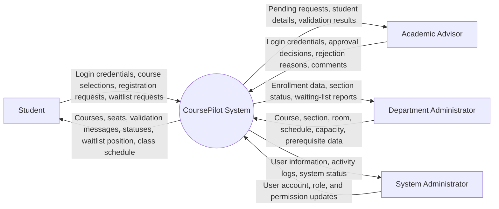
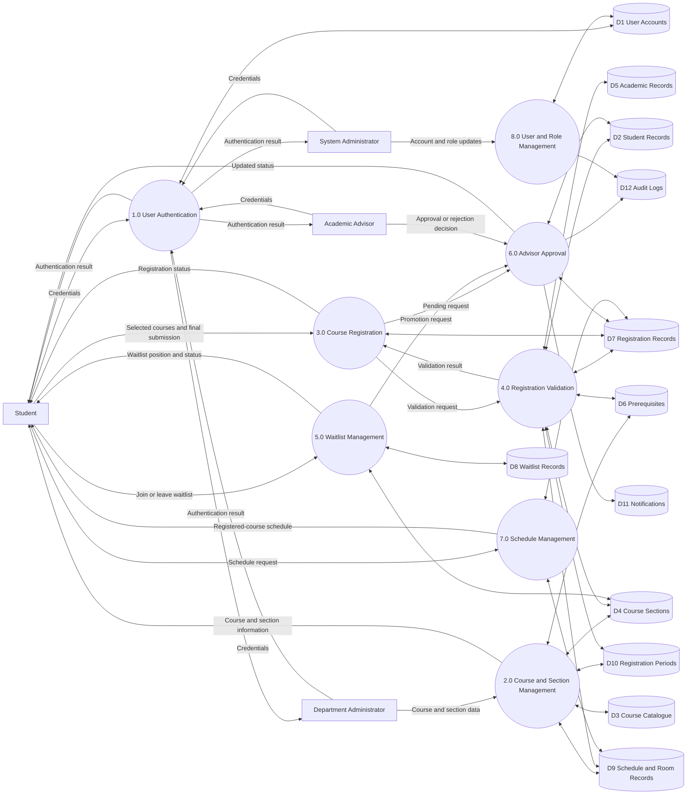
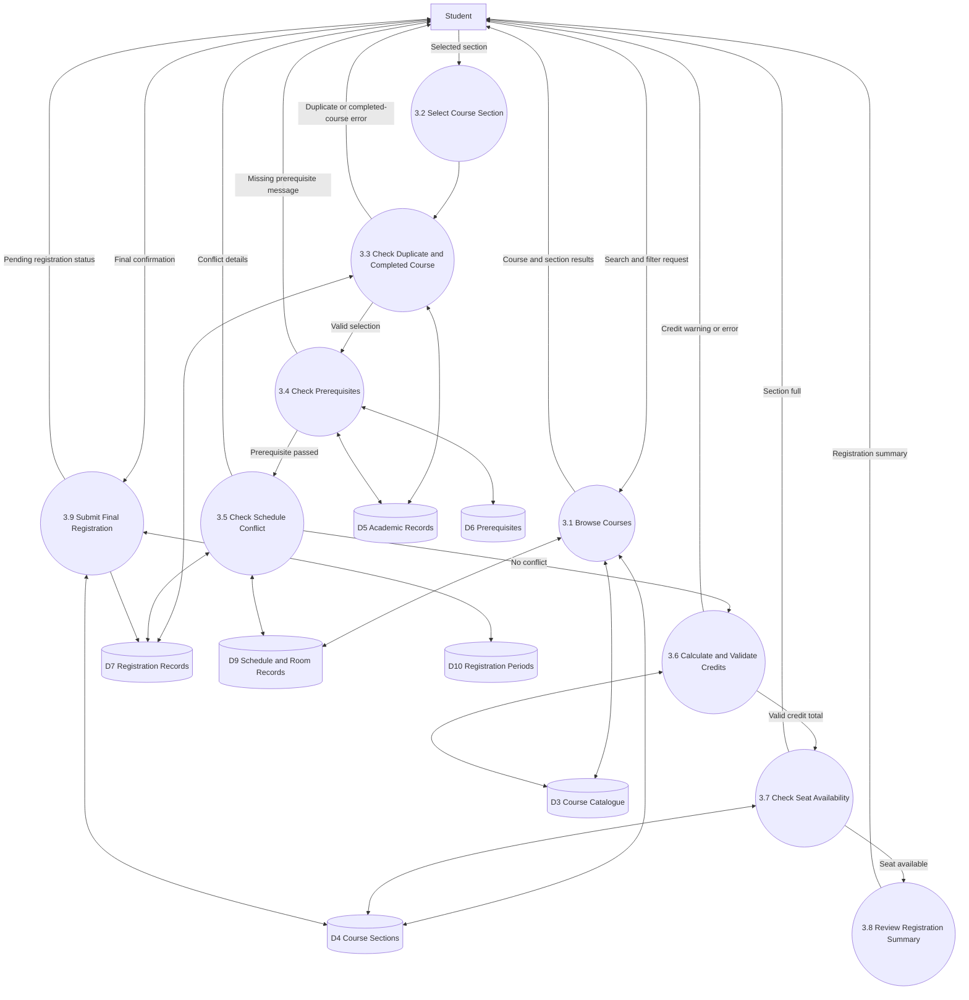
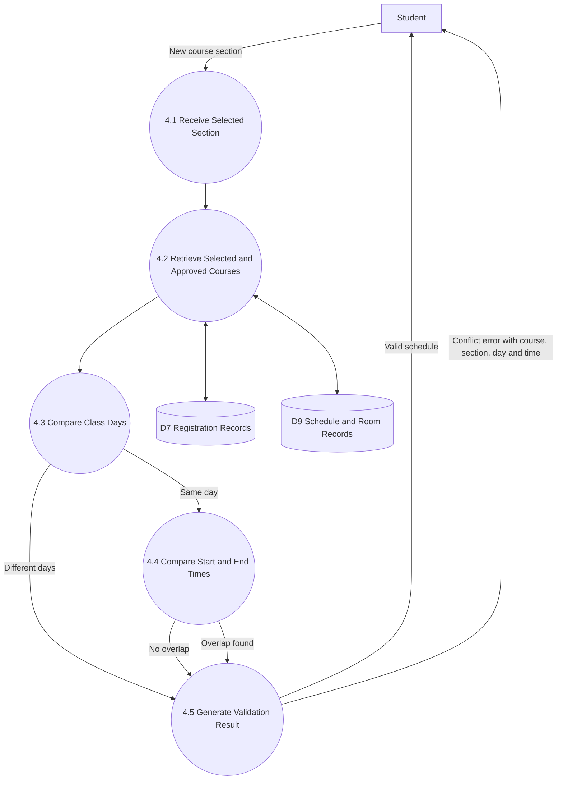
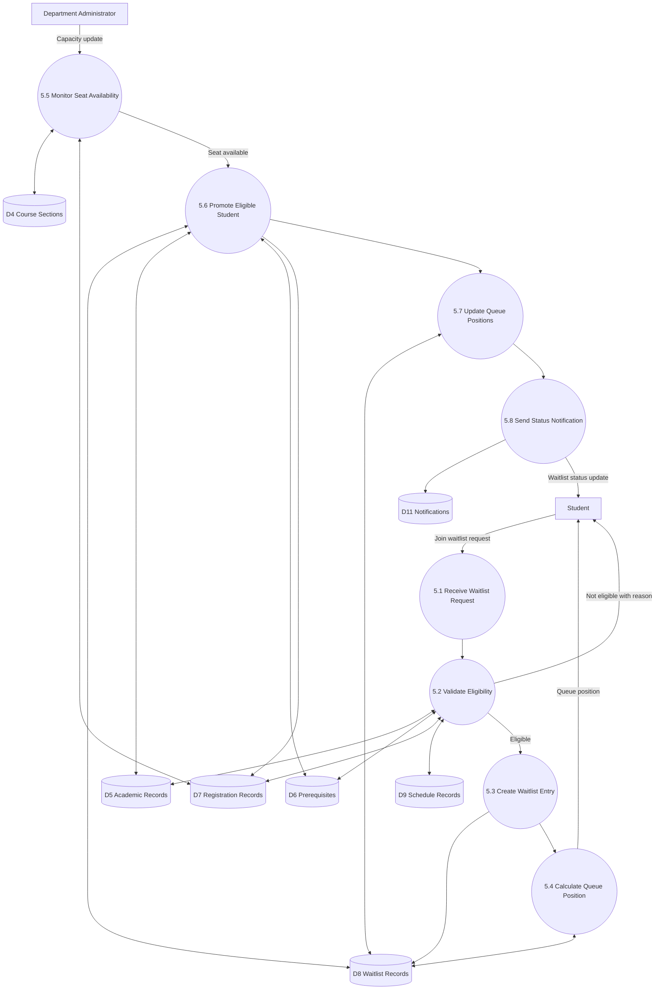
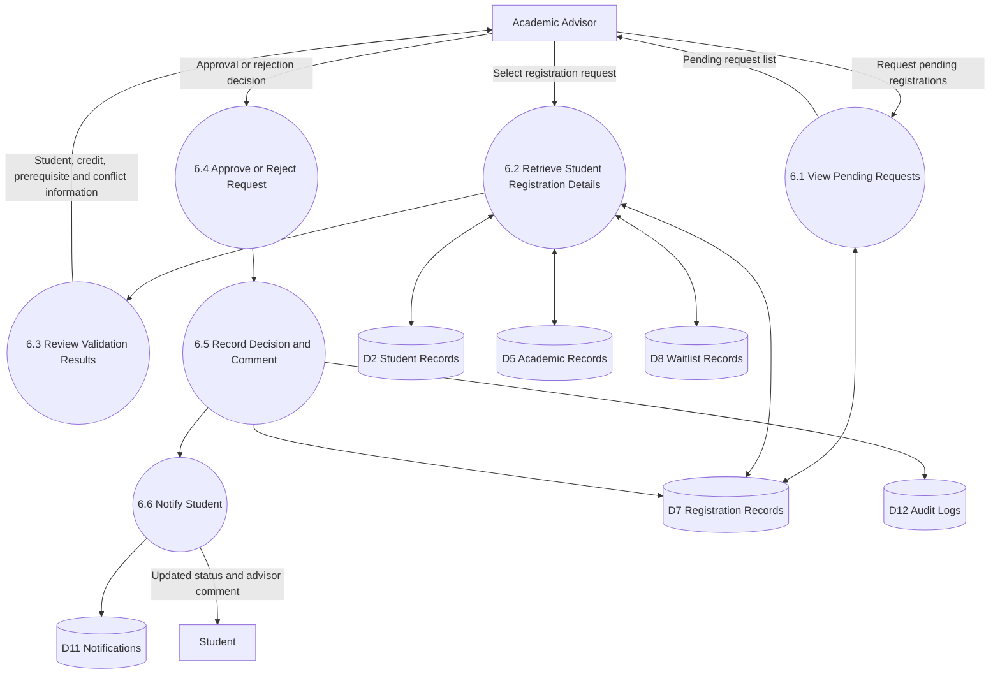
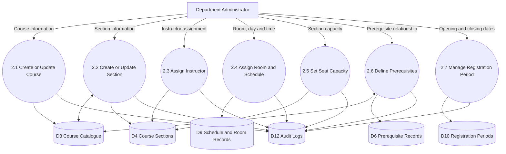

# CoursePilot Data Flow Diagrams

## 1. Introduction

A Data Flow Diagram (DFD) shows how information moves between users, system processes, and data stores.

This document includes:

* Context Diagram
* Level 0 DFD
* Level 1 DFD for Course Registration
* Level 1 DFD for Waitlist Management
* Level 1 DFD for Advisor Approval
* Data stores and major data flows

---

# 2. DFD Components

## 2.1 External Entities

| Entity ID | External Entity          | Description                                                                                   |
| --------- | ------------------------ | --------------------------------------------------------------------------------------------- |
| E1        | Student                  | Browses courses, selects sections, submits registration, joins waitlists, and views schedules |
| E2        | Academic Advisor         | Reviews, approves, or rejects registration requests                                           |
| E3        | Department Administrator | Manages courses, sections, rooms, schedules, capacities, and prerequisites                    |
| E4        | System Administrator     | Manages user accounts, roles, permissions, and system settings                                |

## 2.2 Main Processes

| Process ID | Process                       | Description                                                                 |
| ---------- | ----------------------------- | --------------------------------------------------------------------------- |
| P1         | User Authentication           | Authenticates users and identifies their roles                              |
| P2         | Course and Section Management | Manages course offerings and section information                            |
| P3         | Course Registration           | Processes course selection and final registration                           |
| P4         | Registration Validation       | Checks prerequisites, credits, conflicts, duplicates, and seat availability |
| P5         | Waitlist Management           | Manages waiting-list entries, positions, and promotions                     |
| P6         | Advisor Approval              | Handles registration approval and rejection                                 |
| P7         | Schedule Management           | Generates registered-course lists and weekly schedules                      |
| P8         | User and Role Management      | Manages accounts, roles, and permissions                                    |

## 2.3 Data Stores

| Data Store ID | Data Store                | Description                                                             |
| ------------- | ------------------------- | ----------------------------------------------------------------------- |
| D1            | User Accounts             | Stores login details, account status, and roles                         |
| D2            | Student Records           | Stores student profiles, programs, and advisor assignments              |
| D3            | Course Catalogue          | Stores course codes, titles, credits, and mandatory status              |
| D4            | Course Sections           | Stores sections, instructors, capacities, semesters, and availability   |
| D5            | Academic Records          | Stores completed courses and grades                                     |
| D6            | Prerequisite Records      | Stores prerequisite relationships between courses                       |
| D7            | Registration Records      | Stores selected, pending, approved, rejected, and dropped registrations |
| D8            | Waitlist Records          | Stores queue entries, positions, timestamps, and statuses               |
| D9            | Schedule and Room Records | Stores class days, times, rooms, and timetable information              |
| D10           | Registration Periods      | Stores registration opening and closing dates                           |
| D11           | Notifications             | Stores registration, approval, and waitlist notifications               |
| D12           | Audit Logs                | Stores important system and administrative activities                   |

---

# 3. Context Diagram

The context diagram represents CoursePilot as one main process and shows how external users exchange information with the system.



---

# 4. Level 0 DFD

The Level 0 DFD divides CoursePilot into its major processes.



---

# 5. Level 1 DFD: Course Registration

This diagram shows the detailed course-registration process.



---

# 6. Course Registration Data Flow Description

## 6.1 Course Browsing

The student sends search and filter information to the system.

The system reads:

* Course information from the Course Catalogue
* Section information from Course Sections
* Class time and room information from Schedule and Room Records

The system returns matching course sections to the student.

## 6.2 Course Selection

When the student selects a section, the system checks:

* Duplicate registration
* Previously completed course
* Course prerequisites
* Class schedule conflicts
* Credit limits
* Seat availability

## 6.3 Final Submission

When the student clicks Final Submit, the system performs all validations again.

If every rule passes:

* The registration record is created
* The registration receives Pending status
* The request is sent for advisor review

If a rule fails:

* Submission is blocked
* A clear validation message is returned

---

# 7. Level 1 DFD: Schedule-Conflict Validation



## 7.1 Conflict Rule

Two classes conflict when:

```text
They occur on the same day
AND
New start time is earlier than the existing end time
AND
New end time is later than the existing start time
```

If a conflict exists, the system blocks course selection or final submission.

---

# 8. Level 1 DFD: Waitlist Management



---

# 9. Waitlist Data Flow Description

## 9.1 Joining the Waitlist

When a section is full, the student sends a waitlist request.

The system checks:

* Whether the student is already registered
* Whether the student is already waitlisted
* Prerequisite completion
* Schedule conflicts
* Registration-period status

If the student is eligible:

* A waitlist entry is created
* The joining time is recorded
* A queue position is calculated
* The position is displayed to the student

## 9.2 Seat Availability

A seat may become available when:

* A registered student drops the course
* The administrator increases section capacity
* An approved registration is cancelled

## 9.3 Promotion

When a seat becomes available:

1. The system reads the ordered waiting list.
2. The first eligible student is selected.
3. The student is promoted to Pending or Approved status.
4. Remaining waiting-list positions are updated.
5. A notification is generated.

---

# 10. Level 1 DFD: Advisor Approval



---

# 11. Advisor Approval Data Flow Description

The advisor requests a list of pending registrations.

The system retrieves:

* Student information
* Selected courses
* Total credits
* Prerequisite validation results
* Schedule-conflict results
* Waitlist information

The advisor then:

* Approves the request, or
* Rejects the request and provides a reason

The decision is saved in Registration Records and Audit Logs.

The student receives the updated registration status.

---

# 12. Level 1 DFD: Course and Section Management



---

# 13. Main Data Flow Summary

| Source                            | Data Flow                        | Destination             |
| --------------------------------- | -------------------------------- | ----------------------- |
| Student                           | Login credentials                | Authentication Process  |
| Authentication Process            | Login result and role            | Student                 |
| Student                           | Search and filter request        | Course Browsing Process |
| Course Data Stores                | Course and section details       | Student                 |
| Student                           | Selected course section          | Registration Process    |
| Academic Records                  | Completed courses                | Prerequisite Validation |
| Schedule Records                  | Class days and times             | Conflict Validation     |
| Course Sections                   | Capacity and available seats     | Seat Validation         |
| Student                           | Waitlist request                 | Waitlist Management     |
| Waitlist Records                  | Queue position                   | Student                 |
| Registration Process              | Pending request                  | Academic Advisor        |
| Academic Advisor                  | Approval or rejection            | Registration Records    |
| Registration Records              | Updated status                   | Student                 |
| Registration and Schedule Records | Approved class schedule          | Student                 |
| Department Administrator          | Course and section configuration | Course Data Stores      |
| System Administrator              | User and role updates            | User Accounts           |

---

# 14. DFD Assumptions

The diagrams assume that:

* Students, advisors, and administrators already have user accounts.
* Student academic records are available.
* Courses and sections are configured before registration begins.
* Prerequisite records are accurate.
* Class schedules and room details are available.
* Registration periods are configured.
* Each student has an assigned academic advisor.
* Waitlist order follows the joining timestamp.

---

# 15. Conclusion

The CoursePilot DFDs show how registration information moves between students, advisors, administrators, system processes, and data stores.

The diagrams cover:

* Authentication
* Course browsing
* Course registration
* Prerequisite validation
* Credit validation
* Schedule-conflict detection
* Seat management
* Waiting-list management
* Advisor approval
* Class-schedule generation
* Administrative course management

These data flows will support the complete SRS, ERD, system design, database design, and API design.
