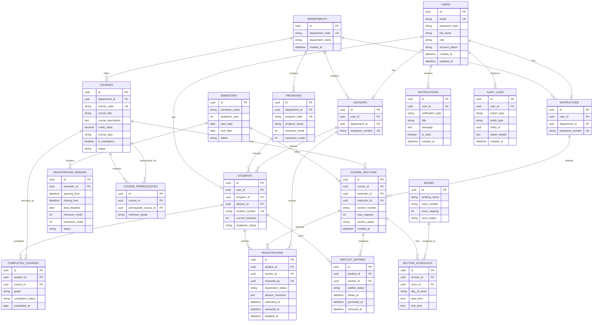

# CoursePilot Entity Relationship Diagram

## 1. Introduction

This document presents the Entity Relationship Diagram (ERD) for CoursePilot.

The ERD defines the main database entities, their important attributes, and the relationships required to support:

* User authentication
* Student and advisor information
* Course and section management
* Prerequisite validation
* Completed-course checking
* Seat-capacity management
* Course registration
* Waiting-list management
* Advisor approval
* Class schedules and rooms
* Notifications and audit logs

---

## 2. Main Entities

The CoursePilot database contains the following main entities:

1. User
2. Student
3. Advisor
4. Instructor
5. Department
6. Academic Program
7. Semester
8. Registration Period
9. Course
10. Course Prerequisite
11. Course Section
12. Room
13. Section Schedule
14. Completed Course
15. Registration
16. Waitlist Entry
17. Notification
18. Audit Log

---

## 3. Entity Relationship Diagram



---

## 4. Entity Descriptions

### 4.1 Users

The `USERS` entity stores common account information for every CoursePilot user.

It includes:

* Email
* Password hash
* Full name
* User role
* Account status
* Creation and update timestamps

Possible roles include:

* Student
* Advisor
* Instructor
* Department administrator
* System administrator

---

### 4.2 Students

The `STUDENTS` entity stores student-specific academic information.

It includes:

* Student number
* Academic program
* Assigned advisor
* Current trimester
* Academic status

Each student is linked to one user account.

---

### 4.3 Advisors

The `ADVISORS` entity stores information about academic advisors.

Each advisor:

* Has one user account
* Belongs to a department
* May advise multiple students
* May review multiple registration requests

---

### 4.4 Instructors

The `INSTRUCTORS` entity stores faculty members assigned to teach course sections.

Each instructor:

* Has one user account
* Belongs to a department
* May teach multiple course sections

---

### 4.5 Departments

The `DEPARTMENTS` entity stores academic department information.

A department may:

* Offer multiple courses
* Contain multiple programs
* Employ advisors
* Employ instructors

---

### 4.6 Programs

The `PROGRAMS` entity stores academic program information.

It includes:

* Program code
* Program name
* Department
* Default minimum credit requirement
* Default maximum credit limit

A program may contain many students.

---

### 4.7 Semesters

The `SEMESTERS` entity represents an academic trimester or semester.

It stores:

* Semester name
* Academic year
* Start date
* End date
* Current status

One semester may contain many course sections.

---

### 4.8 Registration Periods

The `REGISTRATION_PERIODS` entity defines when students can register or drop courses.

It includes:

* Registration opening time
* Registration closing time
* Course-drop deadline
* Minimum credit requirement
* Maximum credit limit
* Registration-period status

---

### 4.9 Courses

The `COURSES` entity stores general course information.

It includes:

* Course code
* Course title
* Course description
* Credit value
* Course type
* Mandatory status
* Active status

A course may have several sections in different semesters.

---

### 4.10 Course Prerequisites

The `COURSE_PREREQUISITES` entity represents prerequisite relationships between courses.

For example:

```text
CSE 201 is a prerequisite for CSE 301
```

The entity stores:

* Target course
* Required prerequisite course
* Minimum acceptable grade, if applicable

A course may have more than one prerequisite.

---

### 4.11 Course Sections

The `COURSE_SECTIONS` entity represents a specific offering of a course.

It includes:

* Course
* Semester
* Section number
* Instructor
* Seat capacity
* Section status

For example:

```text
CSE 301 — Section 2 — Fall 2026
```

---

### 4.12 Rooms

The `ROOMS` entity stores classroom information.

It includes:

* Building name
* Room number
* Room capacity
* Room status

One room may be used by multiple sections at different times.

---

### 4.13 Section Schedules

The `SECTION_SCHEDULES` entity stores the meeting time of each course section.

It includes:

* Course section
* Room
* Day of the week
* Start time
* End time

A course section may have more than one schedule entry.

For example, one section may meet:

```text
Sunday 10:00 AM–11:30 AM
Tuesday 10:00 AM–11:30 AM
```

---

### 4.14 Completed Courses

The `COMPLETED_COURSES` entity stores courses previously completed by students.

It includes:

* Student
* Course
* Grade
* Completion status
* Completion date

This information is used during prerequisite validation and completed-course checking.

---

### 4.15 Registrations

The `REGISTRATIONS` entity stores student course-registration records.

Possible statuses include:

* Draft
* Pending
* Approved
* Rejected
* Dropped

It also stores:

* Student
* Course section
* Reviewing advisor
* Advisor comment
* Submission time
* Review time
* Last update time

A unique constraint should prevent the same student from registering for the same section more than once.

---

### 4.16 Waitlist Entries

The `WAITLIST_ENTRIES` entity stores students waiting for a full course section.

It includes:

* Student
* Course section
* Waiting-list status
* Joining timestamp
* Promotion timestamp
* Removal timestamp

Possible waiting-list statuses include:

* Active
* Promoted
* Removed
* Expired

The queue position should be calculated using the joining timestamp of active entries instead of being permanently stored. This helps prevent incorrect positions when students leave or are promoted.

---

### 4.17 Notifications

The `NOTIFICATIONS` entity stores messages sent to users.

Examples include:

* Registration submitted
* Registration approved
* Registration rejected
* Waiting-list position changed
* Student promoted from waiting list
* Registration period opened or closed

---

### 4.18 Audit Logs

The `AUDIT_LOGS` entity records important system actions.

Examples include:

* Registration submission
* Advisor approval
* Advisor rejection
* Course creation
* Capacity change
* Waiting-list promotion
* User-role change

Audit logs support accountability and troubleshooting.

---

## 5. Main Relationships

| Relationship                | Cardinality  | Description                                  |
| --------------------------- | ------------ | -------------------------------------------- |
| Department to Program       | One-to-Many  | One department may contain multiple programs |
| Program to Student          | One-to-Many  | One program may include many students        |
| Advisor to Student          | One-to-Many  | One advisor may advise many students         |
| Course to Section           | One-to-Many  | One course may have multiple sections        |
| Course to Prerequisite      | Many-to-Many | Courses may require other courses            |
| Semester to Section         | One-to-Many  | One semester may offer multiple sections     |
| Instructor to Section       | One-to-Many  | One instructor may teach multiple sections   |
| Section to Schedule         | One-to-Many  | One section may have multiple meeting times  |
| Room to Schedule            | One-to-Many  | One room may host multiple meetings          |
| Student to Completed Course | One-to-Many  | A student may complete many courses          |
| Student to Registration     | One-to-Many  | A student may submit many registrations      |
| Section to Registration     | One-to-Many  | A section may receive many registrations     |
| Student to Waitlist Entry   | One-to-Many  | A student may join several waiting lists     |
| Section to Waitlist Entry   | One-to-Many  | A section may have several waiting students  |
| User to Notification        | One-to-Many  | A user may receive many notifications        |
| User to Audit Log           | One-to-Many  | A user may perform many logged actions       |

---

## 6. Important Database Constraints

### 6.1 Unique User Email

Each user email must be unique.

### 6.2 Unique Student Number

Each student number must be unique.

### 6.3 Unique Course Code

Each course code must be unique.

### 6.4 Unique Section Offering

A course section should be unique within a semester.

A possible unique combination is:

```text
course_id + semester_id + section_number
```

### 6.5 Unique Student Registration

A student must not have duplicate registration records for the same course section.

A unique constraint should be applied to:

```text
student_id + section_id
```

### 6.6 Unique Waitlist Entry

A student must not join the same section's waiting list more than once.

A unique constraint should be applied to:

```text
student_id + section_id
```

### 6.7 Positive Seat Capacity

The section seat capacity must be greater than zero.

### 6.8 Approved Enrollment Limit

The number of approved registrations must not exceed the section capacity.

### 6.9 Valid Class Time

The section schedule end time must be later than the start time.

### 6.10 Valid Registration Status

Registration status must be limited to supported values.

### 6.11 Valid Waiting-List Status

Waiting-list status must be limited to supported values.

### 6.12 Prerequisite Self-Reference Prevention

A course cannot be its own prerequisite.

---

## 7. Schedule-Conflict Support

Schedule conflicts are checked using `SECTION_SCHEDULES`.

Two sections conflict when:

```text
They occur on the same day
AND
new_start_time < existing_end_time
AND
new_end_time > existing_start_time
```

The system compares a newly selected section with:

* Other selected sections
* Pending registrations
* Approved registrations

If an overlap exists, the system blocks selection or final submission.

---

## 8. Seat and Waitlist Support

The available seat count can be calculated as:

```text
Available Seats = Section Capacity − Number of Approved Registrations
```

When available seats reach zero:

* Direct registration is blocked.
* Eligible students may join the waiting list.
* Waiting-list order is based on `joined_at`.
* The first eligible active entry is considered when a seat becomes available.

Database transactions should be used when allocating the final available seat.

---

## 9. Prerequisite Support

Prerequisite validation uses:

* `COURSE_PREREQUISITES`
* `COMPLETED_COURSES`

The system retrieves all prerequisites for the selected course and compares them with the student's successfully completed courses.

If any required prerequisite is missing, course selection is blocked.

---

## 10. Credit Validation Support

Credit validation uses:

* Credit values from `COURSES`
* Selected registrations from `REGISTRATIONS`
* Minimum and maximum limits from `REGISTRATION_PERIODS` or `PROGRAMS`

The system calculates:

```text
Total Selected Credits = Sum of credits for active selected course registrations
```

Final submission is blocked when the total is below the minimum or above the maximum.

---

## 11. Assumptions

The ERD assumes that:

* One user account belongs to one primary role profile.
* Every student belongs to one academic program.
* Every student has one assigned advisor.
* A section belongs to one course and one semester.
* A section may have multiple weekly meeting times.
* Registration approval is performed by an advisor.
* Waitlist position is derived from active queue timestamps.
* Academic records are available for prerequisite checking.
* Room, instructor, and schedule information are configured before registration.

---

## 12. Conclusion

The CoursePilot ERD provides a relational database structure for course registration, seat management, waiting lists, prerequisites, credit validation, advisor approval, schedules, notifications, and audit logging.

The entities and relationships defined in this document will guide the detailed database design, system architecture, Technical Design Document, and REST API design.
