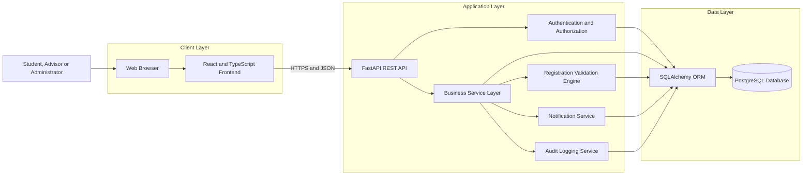
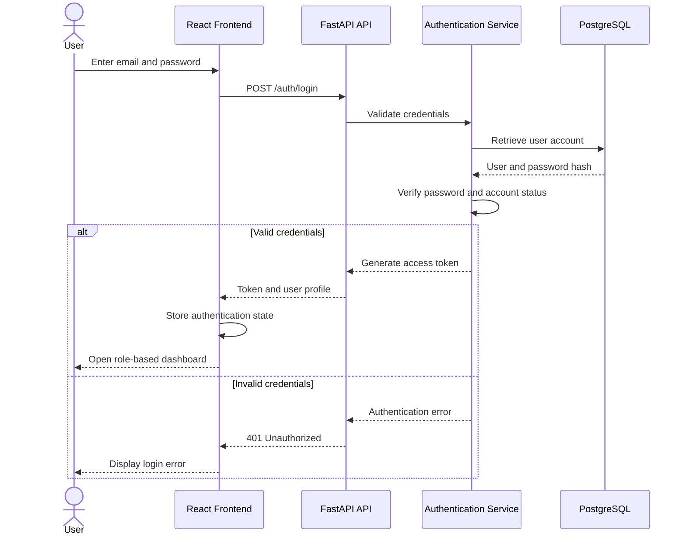
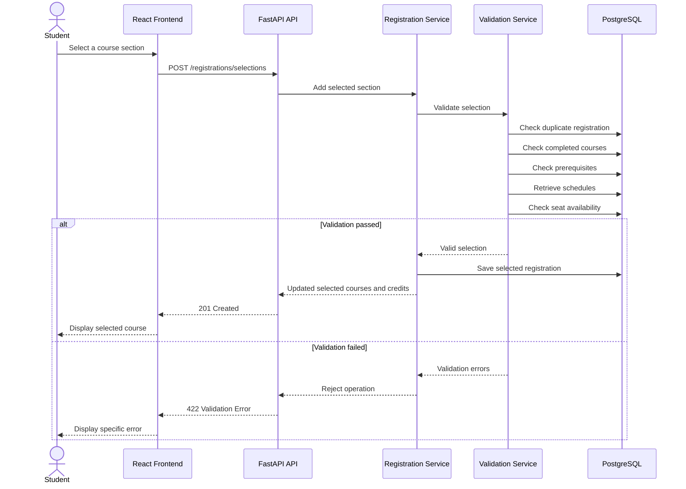
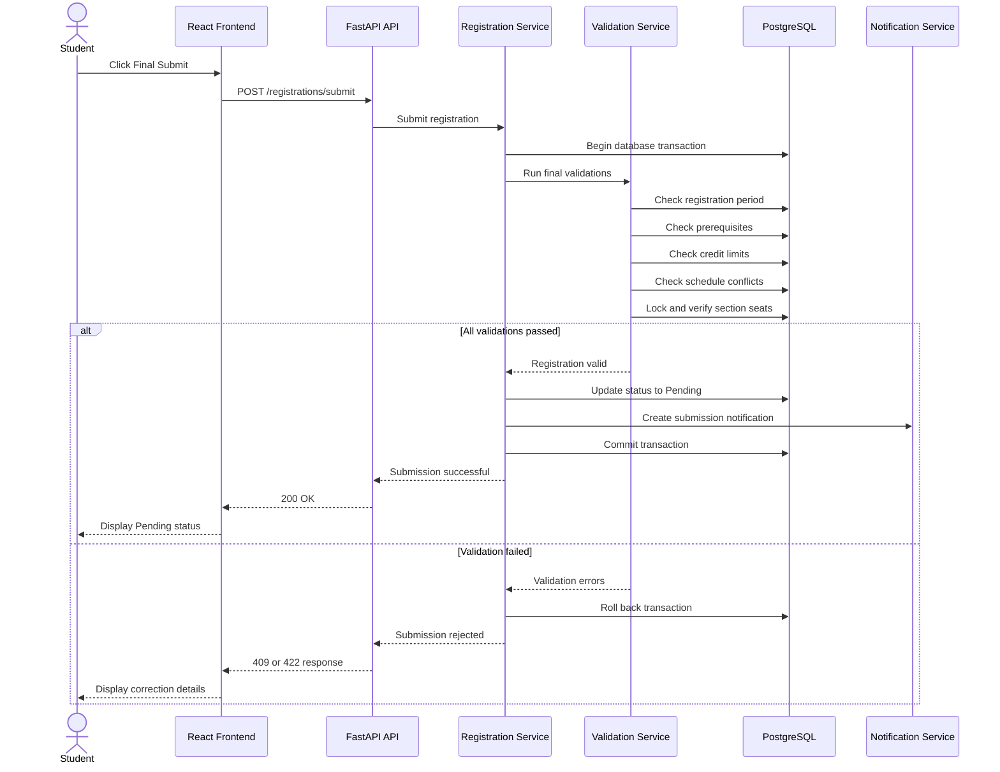
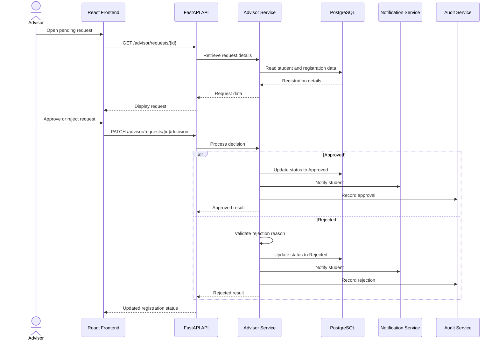
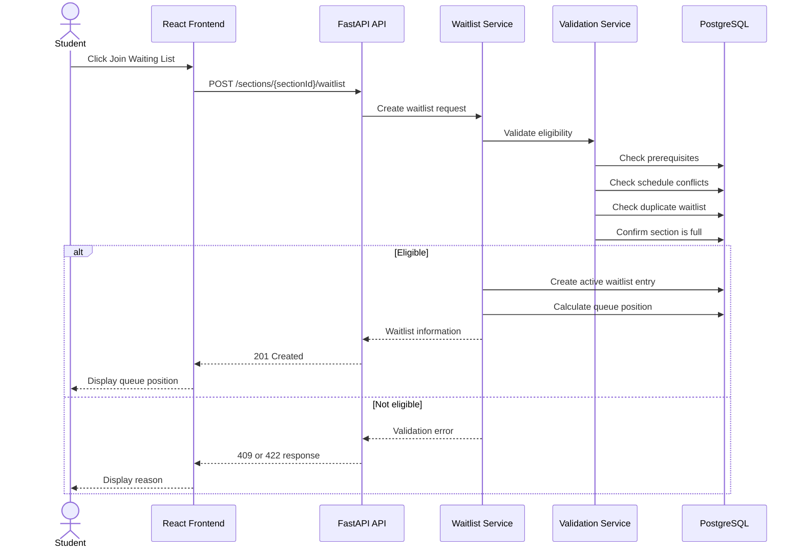
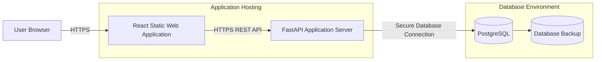

# CoursePilot System Design

## 1. Introduction

This document describes the proposed system architecture and component design of CoursePilot.

CoursePilot is a web-based course-registration platform that supports:

* Course and section browsing
* Real-time seat information
* Course selection
* Prerequisite validation
* Credit-limit validation
* Schedule-conflict detection
* Waiting-list management
* Advisor approval
* Registration-status tracking
* Student timetable generation
* Administrative course management

The system uses a three-tier architecture consisting of:

1. React frontend
2. FastAPI backend
3. PostgreSQL database

---

# 2. Technology Stack

| Layer             | Technology       | Purpose                                 |
| ----------------- | ---------------- | --------------------------------------- |
| Frontend          | React            | Builds the user interface               |
| Frontend language | TypeScript       | Provides type-safe frontend development |
| Build tool        | Vite             | Runs and builds the React application   |
| Backend           | FastAPI          | Provides REST API services              |
| Backend language  | Python           | Implements business logic               |
| Database          | PostgreSQL       | Stores application data                 |
| ORM               | SQLAlchemy       | Manages backend database operations     |
| Validation        | Pydantic         | Validates API request and response data |
| Authentication    | JWT              | Manages authenticated user sessions     |
| Password security | bcrypt or Argon2 | Hashes user passwords                   |
| API documentation | OpenAPI/Swagger  | Documents and tests API endpoints       |
| Version control   | Git and GitHub   | Stores and manages project changes      |
| Deployment        | Docker           | Supports containerized deployment       |

---

# 3. High-Level Architecture



---

# 4. Architectural Style

CoursePilot follows a layered architecture.

## 4.1 Presentation Layer

The presentation layer is implemented using React.

It is responsible for:

* Displaying pages and forms
* Collecting user input
* Showing registration results
* Displaying validation errors
* Maintaining temporary client-side state
* Sending API requests
* Receiving API responses
* Rendering course schedules and waitlists

The frontend must not directly access the database.

---

## 4.2 API Layer

The API layer is implemented using FastAPI.

It is responsible for:

* Receiving HTTP requests
* Validating request data
* Authenticating users
* Checking authorization
* Calling appropriate services
* Returning standardized JSON responses
* Returning suitable HTTP status codes

---

## 4.3 Service Layer

The service layer contains the main CoursePilot business logic.

Examples include:

* Course registration
* Seat validation
* Prerequisite checking
* Credit validation
* Conflict detection
* Waiting-list processing
* Advisor approval
* Course dropping
* Notification creation
* Audit logging

Business rules should be placed in the service layer instead of directly inside API route functions.

---

## 4.4 Repository and Data Access Layer

The repository layer communicates with PostgreSQL through SQLAlchemy.

It is responsible for:

* Creating records
* Reading records
* Updating records
* Deleting records
* Running database queries
* Managing transactions
* Preventing direct SQL duplication across services

---

## 4.5 Database Layer

PostgreSQL stores permanent CoursePilot data.

The database maintains:

* User accounts
* Student profiles
* Advisor profiles
* Departments and programs
* Courses
* Course sections
* Class schedules
* Rooms
* Academic records
* Registrations
* Waiting-list entries
* Notifications
* Audit logs

---

# 5. Frontend Design

## 5.1 Frontend Module Structure

A possible React project structure is:

```text
frontend/
├── public/
├── src/
│   ├── api/
│   │   ├── authApi.ts
│   │   ├── courseApi.ts
│   │   ├── registrationApi.ts
│   │   ├── waitlistApi.ts
│   │   ├── advisorApi.ts
│   │   └── adminApi.ts
│   ├── assets/
│   ├── components/
│   │   ├── common/
│   │   ├── courses/
│   │   ├── registration/
│   │   ├── schedule/
│   │   └── waitlist/
│   ├── contexts/
│   │   └── AuthContext.tsx
│   ├── hooks/
│   ├── layouts/
│   │   ├── StudentLayout.tsx
│   │   ├── AdvisorLayout.tsx
│   │   └── AdminLayout.tsx
│   ├── pages/
│   │   ├── auth/
│   │   ├── student/
│   │   ├── advisor/
│   │   └── admin/
│   ├── routes/
│   ├── types/
│   ├── utils/
│   ├── App.tsx
│   └── main.tsx
├── package.json
└── vite.config.ts
```

---

## 5.2 Main Frontend Pages

### Authentication Pages

* Login page
* Unauthorized-access page

### Student Pages

* Student dashboard
* Course catalogue
* Course-details page
* Selected-course page
* Registration summary
* Waiting-list page
* Registration-status page
* Weekly timetable
* Notification page

### Advisor Pages

* Advisor dashboard
* Pending-request list
* Registration-request details
* Decision-history page

### Department Administrator Pages

* Course-management page
* Section-management page
* Schedule-management page
* Room-management page
* Prerequisite-management page
* Registration-period page
* Enrollment-monitoring page
* Waiting-list-monitoring page

### System Administrator Pages

* User-management page
* Role-management page
* Audit-log page
* System-status page

---

## 5.3 Frontend State Management

CoursePilot frontend state can be divided into two categories.

### Local State

Local component state will manage:

* Form values
* Search terms
* Filter selections
* Dialog visibility
* Loading indicators
* Temporary validation messages

### Shared State

Shared application state will manage:

* Authenticated user
* User role
* Access token
* Selected courses
* Selected credit total
* Notifications
* Registration-period status

React Context may be used for basic shared state.

A dedicated state-management library may be introduced later if the application becomes more complex.

---

## 5.4 Frontend Route Protection

Protected routes must check:

1. Whether the user is authenticated
2. Whether the user has the required role

Example route groups include:

```text
/student/*
/advisor/*
/department-admin/*
/system-admin/*
```

A student must not be able to access advisor or administrator pages by manually entering their URLs.

---

# 6. Backend Design

## 6.1 Backend Module Structure

A possible FastAPI project structure is:

```text
backend/
├── app/
│   ├── api/
│   │   ├── dependencies.py
│   │   └── routes/
│   │       ├── auth.py
│   │       ├── courses.py
│   │       ├── sections.py
│   │       ├── registrations.py
│   │       ├── waitlists.py
│   │       ├── schedules.py
│   │       ├── advisors.py
│   │       ├── administrators.py
│   │       └── users.py
│   ├── core/
│   │   ├── config.py
│   │   ├── security.py
│   │   └── exceptions.py
│   ├── database/
│   │   ├── base.py
│   │   ├── session.py
│   │   └── migrations/
│   ├── models/
│   ├── repositories/
│   ├── schemas/
│   ├── services/
│   │   ├── auth_service.py
│   │   ├── course_service.py
│   │   ├── registration_service.py
│   │   ├── validation_service.py
│   │   ├── waitlist_service.py
│   │   ├── advisor_service.py
│   │   ├── notification_service.py
│   │   └── audit_service.py
│   ├── tests/
│   └── main.py
├── requirements.txt
├── Dockerfile
└── .env.example
```

---

## 6.2 Backend Responsibilities

### API Routes

API routes should:

* Accept requests
* Validate input schemas
* Identify the authenticated user
* Check role permissions
* Call service functions
* Return responses

API routes should not contain complex registration logic.

### Services

Services should:

* Apply business rules
* Coordinate repository operations
* Start and complete transactions
* Generate domain-specific errors
* Create notifications
* Record audit logs

### Repositories

Repositories should:

* Perform database queries
* Return model objects
* Apply reusable filtering
* Support transaction management

### Schemas

Pydantic schemas should define:

* Request bodies
* Query parameters
* Response bodies
* Validation rules

### Models

SQLAlchemy models should represent PostgreSQL tables and relationships.

---

# 7. Main Backend Services

## 7.1 Authentication Service

The authentication service handles:

* Login credential validation
* Password verification
* Access-token creation
* Current-user retrieval
* Account-status checking
* Role validation

---

## 7.2 Course Service

The course service handles:

* Course retrieval
* Course searching
* Course filtering
* Section retrieval
* Prerequisite display
* Mandatory-course display
* Seat-availability calculation

---

## 7.3 Registration Service

The registration service handles:

* Selected-course management
* Final registration submission
* Registration-status changes
* Course dropping
* Advisor review coordination
* Transaction processing

---

## 7.4 Validation Service

The validation service handles:

* Duplicate-course checking
* Completed-course checking
* Prerequisite validation
* Schedule-conflict detection
* Credit calculation
* Credit-limit validation
* Seat validation
* Registration-period validation

---

## 7.5 Waitlist Service

The waitlist service handles:

* Joining a waiting list
* Leaving a waiting list
* Calculating queue position
* Preventing duplicate entries
* Processing seat availability
* Promoting eligible students
* Recalculating remaining positions

---

## 7.6 Advisor Service

The advisor service handles:

* Retrieving assigned students
* Retrieving pending registration requests
* Approving requests
* Rejecting requests
* Storing comments
* Maintaining decision history

---

## 7.7 Notification Service

The notification service creates notifications for:

* Registration submission
* Registration approval
* Registration rejection
* Waiting-list entry
* Waiting-list promotion
* Course-drop completion
* Registration-period updates

---

## 7.8 Audit Service

The audit service records:

* Login-sensitive administrative actions
* Registration submissions
* Advisor decisions
* Capacity changes
* Course changes
* Prerequisite changes
* Waiting-list promotions
* Role and account changes

---

# 8. Authentication Flow



---

# 9. Course-Selection Flow



---

# 10. Final Registration Flow



---

# 11. Advisor Approval Flow



---

# 12. Waiting-List Flow



---

# 13. Seat Availability Design

## 13.1 Available Seat Calculation

Available seats are calculated as:

```text
Available Seats = Section Capacity − Approved Registration Count
```

The displayed number is informational and may change while students are registering.

Therefore, seat availability must always be checked again during confirmation.

---

## 13.2 Concurrency Problem

Two students may attempt to take the final available seat at nearly the same time.

Without transaction control:

* Both students may see one available seat.
* Both requests may pass the initial check.
* The system may accidentally over-enroll the section.

---

## 13.3 Concurrency Solution

The final seat-allocation operation should:

1. Begin a database transaction.
2. Lock the selected section row.
3. Count current approved or reserved registrations.
4. Compare enrollment with capacity.
5. Approve or reserve the seat only when capacity remains.
6. Commit the transaction.
7. Roll back when the seat is no longer available.

PostgreSQL row-level locking may be used through:

```sql
SELECT ... FOR UPDATE
```

This approach ensures only one transaction can allocate the final available seat.

---

# 14. Schedule-Conflict Design

The system checks each new section schedule against the student's:

* Selected sections
* Pending registrations
* Approved registrations

Two schedules conflict when:

```text
same_day
AND new_start_time < existing_end_time
AND new_end_time > existing_start_time
```

Example:

```text
Existing course: 10:00 AM–11:30 AM
New course:      11:00 AM–12:30 PM
Result: Conflict
```

The validation result should contain:

* New course code
* New section
* Existing course code
* Existing section
* Day
* Conflicting time range

---

# 15. Prerequisite Validation Design

The validation process is:

1. Retrieve the selected course.
2. Retrieve its required prerequisites.
3. Retrieve the student's completed courses.
4. Check whether all prerequisite courses were passed.
5. Check the minimum grade when required.
6. Return missing-prerequisite details.

Example validation result:

```json
{
  "eligible": false,
  "missing_prerequisites": [
    {
      "course_code": "CSE 201",
      "course_title": "Data Structures"
    }
  ]
}
```

---

# 16. Credit Validation Design

The credit total is calculated from active selected courses.

```text
Total Selected Credits =
Sum of credit values of selected and active registrations
```

The total is compared with:

* Minimum credit requirement
* Maximum credit limit

Credit limits may come from:

1. Active registration period
2. Student academic program
3. Approved student-specific exception

The system should use the most specific applicable rule.

---

# 17. Waiting-List Design

## 17.1 Queue Ordering

Waiting-list entries are ordered by:

```text
joined_at ASC
```

When timestamps are equal, the entry ID may be used as a secondary ordering value.

## 17.2 Queue Position

Queue position should be calculated dynamically rather than permanently stored.

Example:

```text
Position =
Number of active entries ahead of the student + 1
```

## 17.3 Promotion Process

When a seat becomes available:

1. Lock the section and relevant waiting-list records.
2. Retrieve active entries in queue order.
3. Recheck the first student's eligibility.
4. Promote the first eligible student.
5. Mark the entry as Promoted.
6. Update the student's registration status.
7. Notify the student.
8. Continue only when additional seats remain.

---

# 18. Notification Design

Notifications are stored in the database and displayed in the user portal.

Each notification contains:

* User ID
* Notification type
* Title
* Message
* Read status
* Creation timestamp

Example notification types include:

```text
REGISTRATION_SUBMITTED
REGISTRATION_APPROVED
REGISTRATION_REJECTED
WAITLIST_JOINED
WAITLIST_PROMOTED
COURSE_DROPPED
```

Email or SMS delivery may be added in a future version.

---

# 19. Error-Handling Design

## 19.1 Standard Error Format

The API should return errors in a consistent format.

```json
{
  "success": false,
  "error": {
    "code": "SCHEDULE_CONFLICT",
    "message": "The selected section conflicts with an existing course.",
    "details": {
      "selected_course": "CSE 301",
      "conflicting_course": "CSE 305",
      "day": "Sunday",
      "time": "10:00 AM–11:30 AM"
    }
  }
}
```

## 19.2 Common Error Codes

| Error Code               | Meaning                                   |
| ------------------------ | ----------------------------------------- |
| INVALID_CREDENTIALS      | Login information is incorrect            |
| UNAUTHORIZED             | Authentication is required                |
| FORBIDDEN                | User role does not have permission        |
| RESOURCE_NOT_FOUND       | Requested record does not exist           |
| DUPLICATE_REGISTRATION   | Registration already exists               |
| MISSING_PREREQUISITE     | Required course has not been completed    |
| SCHEDULE_CONFLICT        | Class times overlap                       |
| CREDIT_LIMIT_VIOLATION   | Credit total is outside the allowed range |
| SECTION_FULL             | No direct seat is available               |
| DUPLICATE_WAITLIST_ENTRY | Student is already waitlisted             |
| REGISTRATION_CLOSED      | Registration period is not active         |
| DATABASE_ERROR           | A database operation failed               |

---

# 20. Security Design

## 20.1 Password Security

Passwords must:

* Never be stored as plain text
* Be hashed using bcrypt or Argon2
* Never be returned through API responses

## 20.2 JWT Authentication

The access token should contain:

* User ID
* User role
* Token expiration time

Protected API endpoints must verify the token before processing requests.

## 20.3 Authorization

Role checks must be performed in the backend.

Frontend route protection alone is not sufficient.

## 20.4 Input Validation

All incoming data must be validated using Pydantic schemas.

## 20.5 Database Security

Database credentials must be stored in environment variables.

The application should use a restricted database account instead of a database superuser.

## 20.6 Sensitive Information

API errors must not expose:

* Password hashes
* Secret keys
* Database credentials
* Internal file paths
* Full stack traces

---

# 21. Logging and Audit Design

## 21.1 Application Logging

Application logs should include:

* Timestamp
* Log level
* Request path
* Error description
* Request or correlation ID

## 21.2 Audit Logging

Audit records should be created for:

* Registration submission
* Advisor approval or rejection
* Course drop
* Waiting-list promotion
* Capacity changes
* Prerequisite changes
* User-role changes

Audit records should not be editable by normal users.

---

# 22. Deployment Architecture



A Docker-based deployment may include:

* Frontend container
* Backend container
* PostgreSQL container
* Reverse proxy container

A reverse proxy such as Nginx may provide:

* HTTPS termination
* Request routing
* Static frontend delivery
* API forwarding

---

# 23. Docker Design

A possible project structure is:

```text
CoursePilot/
├── frontend/
│   └── Dockerfile
├── backend/
│   └── Dockerfile
├── docker-compose.yml
├── .env.example
└── README.md
```

The `docker-compose.yml` file may define:

* `frontend`
* `backend`
* `database`

Sensitive values must not be committed to GitHub.

---

# 24. Scalability Design

The system can support future growth through:

* Stateless backend API instances
* Database indexing
* Pagination
* Connection pooling
* Query optimization
* Horizontal backend scaling
* Caching frequently requested course data
* Background processing for notifications

Possible indexed fields include:

* User email
* Student number
* Course code
* Section semester
* Registration student ID
* Registration section ID
* Registration status
* Waitlist section ID
* Waitlist joined time

---

# 25. Testing Strategy

## 25.1 Unit Testing

Unit tests should cover:

* Prerequisite checking
* Schedule-conflict logic
* Credit calculation
* Credit-limit validation
* Seat calculation
* Waiting-list ordering
* Registration status transitions

## 25.2 Integration Testing

Integration tests should cover:

* API and database interaction
* Authentication
* Registration submission
* Advisor approval
* Course dropping
* Waiting-list promotion

## 25.3 Frontend Testing

Frontend tests should cover:

* Form validation
* Route protection
* Error-message rendering
* Course filtering
* Selected-credit updates
* Registration-status display

## 25.4 End-to-End Testing

End-to-end tests should simulate:

1. Student login
2. Course selection
3. Final submission
4. Advisor approval
5. Student schedule viewing

---

# 26. Major Design Decisions

| Design Decision              | Reason                                                                 |
| ---------------------------- | ---------------------------------------------------------------------- |
| React frontend               | Supports reusable and interactive user-interface components            |
| FastAPI backend              | Provides fast API development, validation, and automatic documentation |
| PostgreSQL database          | Supports relational integrity and reliable transactions                |
| REST API                     | Separates frontend and backend responsibilities                        |
| JWT authentication           | Supports stateless API authentication                                  |
| Service-layer business logic | Keeps API routes simple and maintainable                               |
| SQLAlchemy ORM               | Reduces direct SQL duplication and supports PostgreSQL                 |
| Database transactions        | Prevents inconsistent registration and seat allocation                 |
| Dynamic waitlist position    | Prevents outdated queue numbers                                        |
| Role-based access            | Protects student and administrative information                        |
| Mermaid diagrams             | Allows diagrams to render directly in GitHub documentation             |

---

# 27. Design Assumptions

The system design assumes:

* Course and academic records are available.
* Registration rules are configured before registration begins.
* Users have reliable internet access.
* The first version uses in-system notifications.
* Advisor approval is required for final registration.
* The database is the authoritative source for seat availability.
* Registration and seat changes use database transactions.
* The initial deployment may run on one backend server.
* The architecture should support future expansion.

---

# 28. Conclusion

The CoursePilot system uses a layered web architecture with a React frontend, FastAPI backend, and PostgreSQL database.

The design separates user-interface, API, business-logic, and data-access responsibilities. It also provides technical solutions for the system's most important challenges:

* Accurate seat availability
* Concurrent registration attempts
* Prerequisite validation
* Credit-limit enforcement
* Schedule-conflict detection
* Ordered waiting-list management
* Advisor approval
* Secure role-based access
* Reliable error handling
* Audit logging

This system design will guide the detailed Technical Design Document, database schema, REST API implementation, testing, and deployment.
