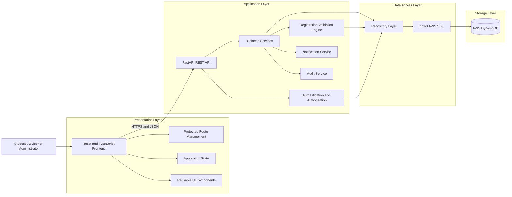
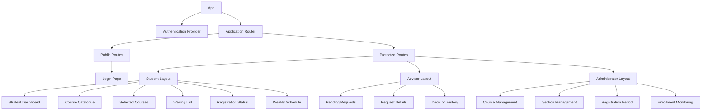
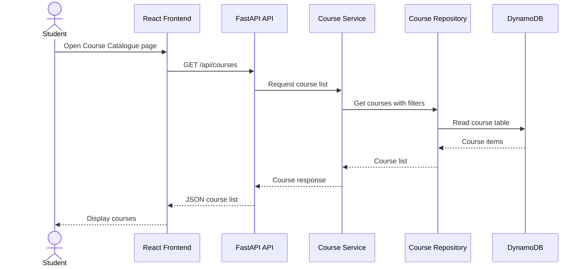
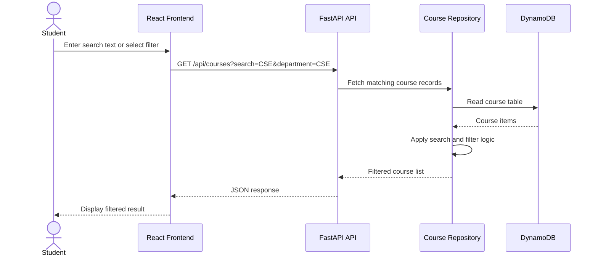
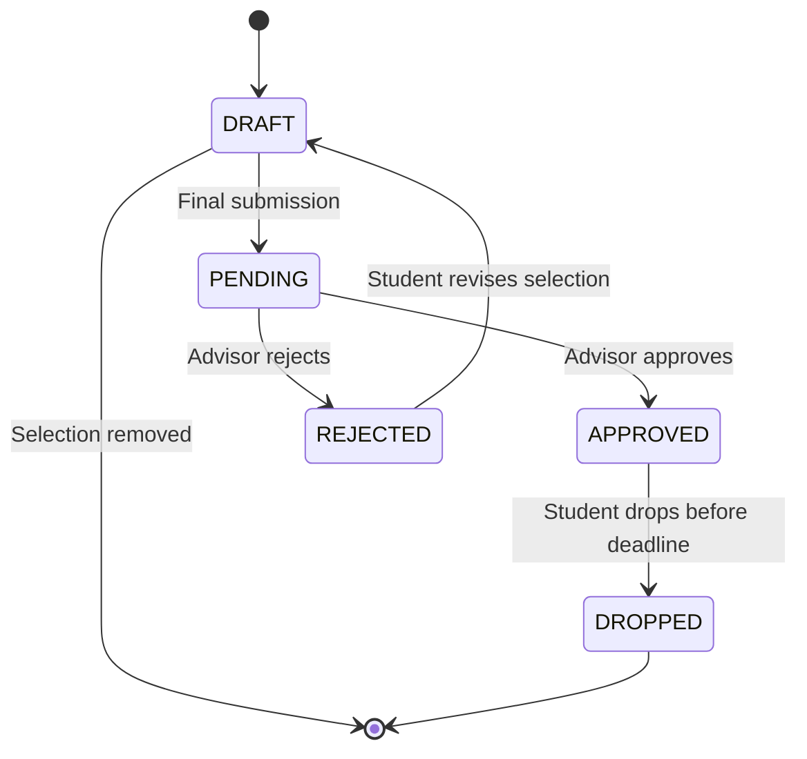
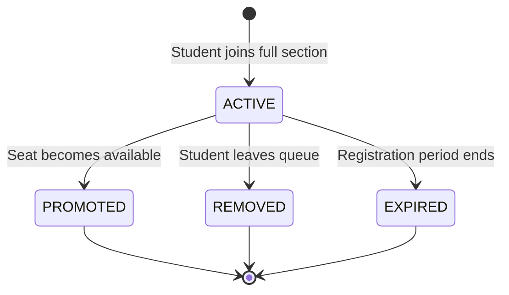
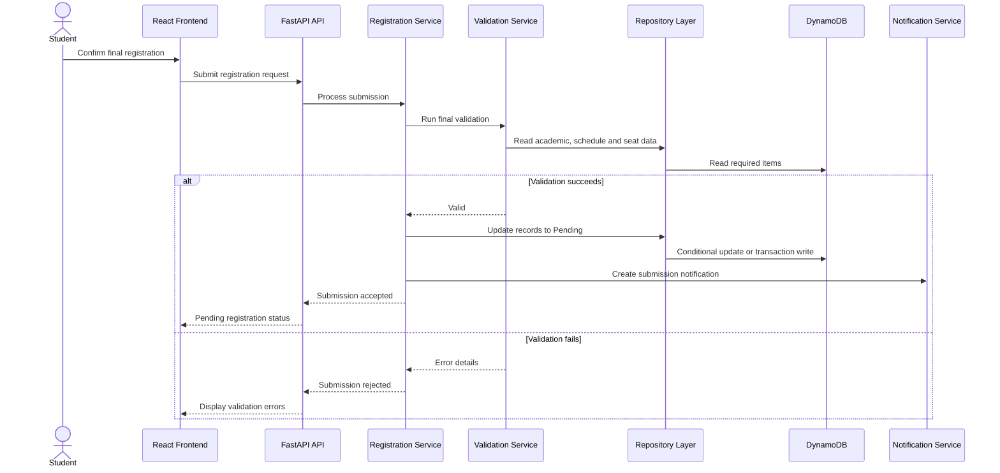
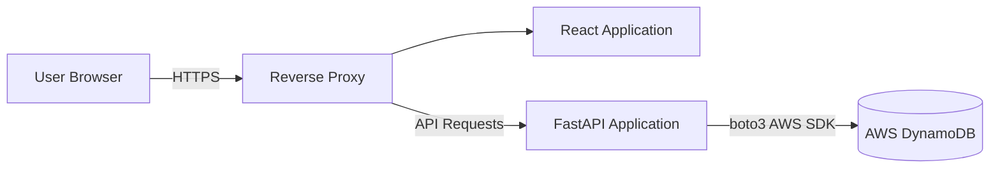

# CoursePilot Technical Design Document

## 1. Document Information

| Item | Details |
| --- | --- |
| Project Name | CoursePilot |
| Document Type | Technical Design Document |
| Frontend | React, TypeScript, Vite |
| Backend | FastAPI, Python |
| Database | AWS DynamoDB |
| Database SDK | boto3 |
| API Style | REST |
| Authentication | JSON Web Token |
| Status | Proposed and Initial Implementation Design |
| Version | 1.1 |

---

# 2. Introduction

## 2.1 Purpose

This Technical Design Document describes how CoursePilot will be implemented.

It translates the business requirements, product requirements, functional requirements, non-functional requirements, use cases, Data Flow Diagrams, and system design into a practical software design.

The document defines:

* Overall system architecture
* Frontend and backend components
* DynamoDB data access
* Authentication and authorization
* Course browsing and searching
* Registration validation
* Seat-allocation control
* Waiting-list processing
* Advisor approval
* Notifications
* Error handling
* Security
* Testing
* Deployment
* Performance and scalability

## 2.2 Scope

The technical design covers the first version of CoursePilot.

The system will support:

* Student authentication
* Course browsing and searching
* Course-section viewing
* Seat-availability display
* Prerequisite validation
* Credit validation
* Schedule-conflict detection
* Waiting-list management
* Final registration submission
* Advisor approval and rejection
* Registration-status tracking
* Approved schedule viewing
* Course and section administration
* User and role management
* Notifications and audit logging

The current implementation focus is the course-catalog feature, which includes:

* A frontend course-catalog interface
* Backend REST API endpoints for course retrieval
* Course search and filtering
* DynamoDB storage for course records
* Seed data for development and testing

## 2.3 Related Documents

This document should be read with:

* `01-project-overview.md`
* `08-prd.md`
* `13-functional-requirements.md`
* `14-non-functional-requirements.md`
* `15-use-cases.md`
* `16-dfd.md`
* `17-srs.md`
* `18-erd.md`
* `19-system-design.md`
* `21-database-design.md`
* `22-api-design.md`

---

# 3. Design Goals

The CoursePilot design has the following goals:

1. Prevent course-section over-enrollment.
2. Provide accurate course and seat information.
3. Detect invalid registration before submission.
4. Clearly explain prerequisite and schedule errors.
5. Maintain fair waiting-list order.
6. Support secure role-based access.
7. Keep frontend, business logic, and database responsibilities separate.
8. Protect student and registration information.
9. Support future increases in users and course sections.
10. Make the application easy to test and maintain.
11. Use environment-based configuration for cloud database access.
12. Avoid committing sensitive AWS credentials to the repository.

---

# 4. Technical Constraints

The system has the following technical constraints:

* The frontend must use React.
* The frontend must use TypeScript.
* The frontend build tool must be Vite.
* The backend must use FastAPI.
* The backend must use Python.
* The database layer will use AWS DynamoDB.
* The backend will access DynamoDB using boto3.
* Frontend and backend communication must use REST APIs.
* API data must use JSON.
* API input and output should be validated using Pydantic schemas.
* The system must be managed through Git and GitHub.
* Sensitive configuration values must not be committed to the repository.
* The first version may use a single backend application instance.
* In-system notifications are sufficient for the first version.
* Course and academic records may initially be entered manually or loaded using seed data.

---

# 5. High-Level Architecture

CoursePilot follows a layered three-tier architecture.



The frontend never communicates directly with DynamoDB. All data requests pass through the FastAPI backend.

---

# 6. Architectural Layers

## 6.1 Presentation Layer

The presentation layer is responsible for:

* Displaying application pages
* Collecting user input
* Displaying loading and error states
* Managing selected courses temporarily
* Showing registration status
* Rendering weekly schedules
* Calling backend APIs
* Protecting frontend routes according to user role

The presentation layer must not directly access DynamoDB. It should communicate only with the FastAPI REST API.

## 6.2 API Layer

The API layer is responsible for:

* Receiving HTTP requests
* Validating request formats
* Identifying authenticated users
* Checking role permissions
* Calling business services
* Formatting API responses
* Returning suitable HTTP status codes
* Exposing Swagger/OpenAPI documentation

API route handlers should remain small and should not contain complex business rules.

## 6.3 Service Layer

The service layer implements CoursePilot business rules.

It is responsible for:

* Course retrieval
* Course selection
* Prerequisite validation
* Credit calculation
* Schedule-conflict detection
* Seat checking
* Waiting-list processing
* Final submission
* Advisor approval
* Course dropping
* Notification generation
* Audit recording

## 6.4 Repository Layer

The repository layer is responsible for database operations.

It provides reusable functions for:

* Retrieving users
* Searching courses
* Retrieving course sections
* Reading completed courses
* Creating registration records
* Updating statuses
* Creating waitlist entries
* Retrieving waiting-list order
* Writing notifications
* Writing audit logs

The repository layer hides DynamoDB-specific implementation details from API routes and service classes.

## 6.5 Database Layer

AWS DynamoDB is the authoritative data source for:

* User accounts
* Courses
* Sections
* Seat capacity
* Academic records
* Registrations
* Waiting-list records
* Advisor decisions
* Notifications
* Audit logs

For the current course-catalog implementation, the main DynamoDB table stores course records with attributes such as course code, title, department, semester, instructor, credit value, capacity, and available seats.

---

# 7. Frontend Technical Design

## 7.1 Main Frontend Modules

| Module | Responsibility |
| --- | --- |
| Authentication | Login, logout, token handling and current-user state |
| Course Catalogue | Course searching, filtering and course-detail display |
| Course Selection | Selected-course list and removal |
| Validation Display | Prerequisite, conflict, credit and seat messages |
| Registration | Summary, final submission and status tracking |
| Waitlist | Join, leave, position and status display |
| Schedule | Approved-course list and weekly timetable |
| Advisor Portal | Pending requests, details and decisions |
| Administration | Course, section, prerequisite and capacity management |
| Notifications | Notification list and read status |

## 7.2 Frontend Component Hierarchy



## 7.3 Frontend State

The frontend should maintain several types of state.

### Authentication State

* Current user
* User role
* Authentication status
* Access token
* Token expiration

### Registration State

* Selected courses
* Selected credits
* Validation results
* Registration summary
* Submission status

### Interface State

* Search text
* Active filters
* Loading status
* Error messages
* Confirmation dialogs
* Notification count

## 7.4 API Communication

A centralized API client should:

* Store the base API URL
* Add authentication headers when authentication is implemented
* Convert request bodies to JSON
* Handle common errors
* Detect expired authentication
* Redirect unauthorized users
* Return typed response objects

Example frontend request flow for the course catalogue:

```text
CourseCatalogue component
    ↓
courseApi.getCourses(search, department, semester)
    ↓
GET /api/courses
    ↓
FastAPI backend
    ↓
DynamoDB repository
    ↓
JSON response
    ↓
React course list rendering
```

## 7.5 Frontend Validation

Frontend validation may check:

* Empty required fields
* Invalid form formats
* Missing rejection reason
* Invalid capacity input
* Invalid schedule time input
* Empty search/filter values

Business-critical validation must also occur in the backend.

The frontend must never be treated as the final authority for:

* Seat availability
* Prerequisites
* Credit limits
* Schedule conflicts
* User permissions

---

# 8. Backend Technical Design

## 8.1 Backend Modules

| Module | Responsibility |
| --- | --- |
| Authentication Service | Credential checking, token creation and current-user retrieval |
| User Service | User account and role management |
| Course Service | Course search, filters and details |
| Section Service | Section, instructor, room, schedule and capacity management |
| Registration Service | Selection, submission, status and course dropping |
| Validation Service | Prerequisite, credit, conflict, duplicate and seat validation |
| Waitlist Service | Queue entry, ordering, removal and promotion |
| Advisor Service | Pending requests, approval, rejection and comments |
| Schedule Service | Student schedule and timetable generation |
| Notification Service | In-system notification creation and retrieval |
| Audit Service | Important activity recording |

## 8.2 Dependency Direction

The expected dependency direction is:

```text
API Route
    ↓
Service
    ↓
Repository
    ↓
boto3
    ↓
DynamoDB
```

A repository should not call an API route.

A database item should not contain frontend logic.

A frontend component should not contain database rules.

## 8.3 Backend Folder Structure

A proposed backend folder structure is:

```text
backend/
├── app/
│   ├── api/
│   │   └── routes/
│   │       ├── courses.py
│   │       ├── registrations.py
│   │       ├── waitlists.py
│   │       └── users.py
│   ├── core/
│   │   ├── config.py
│   │   └── security.py
│   ├── database/
│   │   ├── dynamodb.py
│   │   └── seed_courses.py
│   ├── repositories/
│   │   ├── course_repository.py
│   │   ├── registration_repository.py
│   │   └── waitlist_repository.py
│   ├── schemas/
│   │   ├── course.py
│   │   ├── registration.py
│   │   └── user.py
│   ├── services/
│   │   ├── course_service.py
│   │   ├── registration_service.py
│   │   └── validation_service.py
│   └── main.py
├── requirements.txt
└── .env.example
```

For the current implementation phase, a simpler structure may be used first and later refactored into this layered structure.

---

# 9. DynamoDB Technical Design

## 9.1 DynamoDB Access Method

The backend will use boto3 to communicate with DynamoDB.

The DynamoDB client or resource should be initialized from environment variables.

Example configuration values:

```text
AWS_REGION=us-east-1
DYNAMODB_COURSES_TABLE=CoursePilotCourses
```

The backend should not hard-code table names or AWS region values inside business logic.

## 9.2 DynamoDB Helper Responsibility

A DynamoDB helper module should:

* Load environment variables
* Create a boto3 DynamoDB resource
* Return table objects
* Keep database configuration in one place
* Raise clear errors when configuration is missing

## 9.3 Course Table

For the course-catalog feature, one table can be used:

```text
Table name: CoursePilotCourses
Partition key: course_id
```

Example item:

```json
{
  "course_id": "cse-101",
  "code": "CSE 101",
  "title": "Introduction to Computer Science",
  "department": "CSE",
  "semester": "Fall 2026",
  "instructor": "Dr. Rahman",
  "credits": 3,
  "capacity": 40,
  "available_seats": 12,
  "is_mandatory": true,
  "level": "Undergraduate"
}
```

## 9.4 Future Table Design

Future versions may add separate tables for:

* Users
* Students
* Advisors
* Courses
* Sections
* Registrations
* Waitlists
* Notifications
* Audit logs

A single-table design may also be considered later if the project needs more complex access patterns.

## 9.5 Access Patterns

Important access patterns include:

| Access Pattern | Example |
| --- | --- |
| List all courses | Show course catalogue |
| Search by code/title | Search for `CSE` or `Data Structures` |
| Filter by department | Show only CSE courses |
| Filter by semester | Show Fall 2026 courses |
| Filter by mandatory status | Show mandatory courses |
| Filter by seat availability | Show courses with available seats |
| Retrieve one course | Show course details |

For the initial version, scan-based filtering is acceptable for small development seed data. For production-scale data, secondary indexes or improved key design should be added.

---

# 10. Authentication Design

## 10.1 Login Process

1. The user submits an email or university identifier and password.
2. The backend retrieves the user account.
3. The password is compared with the stored password hash.
4. The account status is checked.
5. A JWT access token is generated.
6. The user profile and token are returned.
7. The frontend opens the correct role-based dashboard.

## 10.2 JWT Contents

The token may contain:

```json
{
  "sub": "user-id",
  "role": "student",
  "exp": 1781726400
}
```

## 10.3 Authorization

Protected endpoints must validate:

* Token existence
* Token signature
* Token expiration
* Account status
* Required user role
* Resource ownership

For example, a student may only access registrations belonging to that student.

## 10.4 Password Storage

Passwords must be:

* Hashed using Argon2 or bcrypt
* Salted by the password-hashing library
* Excluded from API responses
* Excluded from application logs

---

# 11. Course Browsing Design

The course catalogue should support:

* Pagination
* Search by course code
* Search by title
* Department filtering
* Course-level filtering
* Mandatory-course filtering
* Seat-availability filtering
* Semester filtering

A course response should include:

* Course ID
* Course code
* Course title
* Department
* Semester
* Instructor
* Credit value
* Capacity
* Available seats
* Mandatory status
* Course level

For the current course-catalog feature, the backend endpoint will retrieve records from DynamoDB and return a JSON list to the frontend.

## 11.1 Course API Flow



## 11.2 Search and Filter Flow



---

# 12. Registration Domain Design

## 12.1 Registration Statuses

The system supports:

* `DRAFT`
* `PENDING`
* `APPROVED`
* `REJECTED`
* `DROPPED`

Waiting-list status should be maintained separately.

## 12.2 Registration Status Transitions



## 12.3 Allowed Transitions

| Current Status | Allowed Next Status |
| --- | --- |
| Draft | Pending |
| Pending | Approved or Rejected |
| Rejected | Draft |
| Approved | Dropped |
| Dropped | No active transition |

The backend must reject unsupported status transitions.

---

# 13. Registration Validation Engine

## 13.1 Validation Order

The validation engine should perform checks in the following order:

1. User authorization
2. Registration-period validation
3. Course and section existence
4. Duplicate-selection validation
5. Previously completed-course validation
6. Prerequisite validation
7. Schedule-conflict validation
8. Credit calculation
9. Credit-limit validation
10. Seat-availability validation

## 13.2 Selection Validation

During course selection, the system should immediately check:

* Duplicate section
* Completed course
* Missing prerequisite
* Schedule conflict
* Section availability

Credit totals should update after a valid selection.

## 13.3 Final Validation

All rules must be checked again during final submission.

This is necessary because:

* Seats may have changed.
* Registration may have closed.
* Section information may have changed.
* Another registration may have been approved.
* Student selections may have changed.

## 13.4 Validation Result Structure

```json
{
  "valid": false,
  "errors": [
    {
      "code": "MISSING_PREREQUISITE",
      "message": "CSE 201 must be completed before registering for CSE 301.",
      "section_id": "section-001",
      "details": {
        "required_course_code": "CSE 201"
      }
    }
  ]
}
```

---

# 14. Prerequisite Validation Algorithm

## 14.1 Input

* Student identifier
* Selected course identifier

## 14.2 Data Required

* Course prerequisite records
* Student completed-course records
* Minimum required grade, when configured

## 14.3 Algorithm

```text
function validatePrerequisites(studentId, courseId):
    prerequisites = getPrerequisites(courseId)

    if prerequisites is empty:
        return valid

    completedCourses = getCompletedCourses(studentId)
    missingPrerequisites = []

    for prerequisite in prerequisites:
        matchingCourse = find completed course

        if matchingCourse does not exist:
            add prerequisite to missingPrerequisites
        else if minimum grade is required:
            if completed grade does not satisfy requirement:
                add prerequisite to missingPrerequisites

    if missingPrerequisites is empty:
        return valid

    return invalid with missingPrerequisites
```

---

# 15. Schedule-Conflict Design

## 15.1 Conflict Condition

Two classes conflict when:

```text
same day
AND new start time < existing end time
AND new end time > existing start time
```

## 15.2 Compared Registrations

The new section should be compared against:

* Selected draft registrations
* Pending registrations
* Approved registrations

Rejected and dropped registrations should not block selection.

## 15.3 Multiple Meeting Times

A section may have multiple schedule records.

Each schedule record of the new section must be compared with every active schedule record already belonging to the student.

## 15.4 Conflict Response

The response should include:

* New course code
* New section
* Conflicting course code
* Conflicting section
* Day
* Start time
* End time

---

# 16. Credit Validation Design

## 16.1 Credit Calculation

```text
Total Credits =
Sum of credit values for active selected registrations
```

## 16.2 Credit Sources

Credit limits may be determined from:

1. Student-specific approved exception
2. Active registration period
3. Academic program default

The most specific applicable setting should be used.

## 16.3 Validation Behavior

During course selection:

* The current total is displayed.
* A warning may be displayed when the total exceeds the normal limit.

During final submission:

* A total below the minimum blocks submission.
* A total above the maximum blocks submission.

---

# 17. Seat-Allocation Design

## 17.1 Available Seat Formula

```text
Available Seats =
Section Capacity − Approved or Reserved Seat Count
```

## 17.2 Displayed Seat Count

The displayed seat count is informational.

The backend must not assume that an earlier displayed value remains correct during final confirmation.

## 17.3 DynamoDB Concurrency Control

To allocate a limited seat safely, the backend should use DynamoDB conditional updates or transaction writes.

A safe seat-allocation process should:

1. Read the selected section or course item.
2. Check that `available_seats` is greater than zero.
3. Use a conditional update to reduce the available seat count only if seats are still available.
4. Create or update the related registration item.
5. Return a clear error if the conditional update fails.
6. Re-fetch the latest seat value when needed.

Example condition:

```text
available_seats > 0
```

Example update intent:

```text
SET available_seats = available_seats - 1
ONLY IF available_seats > 0
```

## 17.4 Over-Enrollment Prevention

The system must prevent:

```text
approved_or_reserved_count > seat_capacity
```

Backend validation and DynamoDB conditional writes must both support this rule.

---

# 18. Waiting-List Design

## 18.1 Waiting-List Statuses

The system supports:

* `ACTIVE`
* `PROMOTED`
* `REMOVED`
* `EXPIRED`

## 18.2 Waiting-List State Changes



## 18.3 Queue Ordering

Active entries should be ordered by:

```text
joined_at ASC, waitlist_id ASC
```

## 18.4 Position Calculation

Waiting-list position should be calculated dynamically.

```text
Position =
Number of active entries ahead of the student + 1
```

The position should not be permanently stored because it changes when users join, leave, expire, or are promoted.

## 18.5 Join Validation

Before creating an entry, the system must check:

* The section is full.
* Registration is open.
* The student is not already registered.
* The student is not already waitlisted.
* Prerequisites are satisfied.
* No schedule conflict exists.

## 18.6 Promotion Algorithm

```text
function processWaitlist(sectionId):
    read section item
    read active waitlist entries ordered by joined time

    availableSeats = calculateAvailableSeats(sectionId)

    while availableSeats > 0:
        entries = getActiveEntriesOrderedByJoinedTime(sectionId)

        if entries is empty:
            break

        promoted = false

        for entry in entries:
            result = revalidateStudent(entry.studentId, sectionId)

            if result is valid:
                update registration using conditional write
                reduce available seat count using conditional update
                mark waitlist entry as PROMOTED
                create notification
                write audit log
                availableSeats = availableSeats - 1
                promoted = true
                break
            else:
                mark or flag invalid entry according to policy

        if promoted is false:
            break
```

For strong consistency, related updates may use DynamoDB transaction writes.

---

# 19. Final Registration Submission

## 19.1 Submission Process



## 19.2 Submission Result

A successful submission should:

* Change selected registration records to Pending.
* Record the submission time.
* Associate the request with the student.
* Make the request visible to the assigned advisor.
* Create a student notification.
* Create an audit record.

---

# 20. Advisor Decision Design

## 20.1 Advisor Access

The advisor may view requests only for assigned students unless broader administrative permission exists.

## 20.2 Approval

Approval should:

1. Recheck request status.
2. Revalidate seat availability when necessary.
3. Update status to Approved.
4. Record the advisor and review time.
5. Create a student notification.
6. Write an audit record.

When seat count must be changed, DynamoDB conditional writes should be used to prevent inconsistent updates.

## 20.3 Rejection

Rejection should:

1. Require a reason.
2. Update status to Rejected.
3. Store the advisor comment.
4. Record the advisor and review time.
5. Release any reserved seat if one was reserved.
6. Process the waiting list when a seat becomes available.
7. Notify the student.
8. Write an audit record.

---

# 21. Course-Drop Design

A student may drop a course when:

* The registration is Approved.
* The drop deadline has not passed.
* The user owns the registration.

The drop process should:

1. Validate the drop deadline.
2. Check registration ownership.
3. Change the registration status to Dropped.
4. Release the seat using a safe update.
5. Process the waiting list.
6. Update the student's schedule.
7. Create a notification.
8. Write an audit log.

---

# 22. Notification Design

## 22.1 Notification Types

* `REGISTRATION_SUBMITTED`
* `REGISTRATION_APPROVED`
* `REGISTRATION_REJECTED`
* `WAITLIST_JOINED`
* `WAITLIST_PROMOTED`
* `WAITLIST_REMOVED`
* `COURSE_DROPPED`
* `REGISTRATION_PERIOD_OPENED`
* `REGISTRATION_PERIOD_CLOSED`

## 22.2 Notification Data

Each notification should contain:

* Recipient user ID
* Notification type
* Title
* Message
* Read status
* Creation time
* Optional related entity ID

## 22.3 Initial Delivery Method

The first version will use in-system notifications.

Email and SMS may be added later.

---

# 23. Audit Design

Audit records should be created for:

* Registration submission
* Advisor approval
* Advisor rejection
* Course drop
* Waiting-list promotion
* Course creation
* Section creation
* Capacity update
* Schedule update
* Prerequisite update
* User-role update
* Account activation or deactivation

Each audit record should contain:

* Acting user ID
* Action type
* Entity type
* Entity ID
* Action details
* Timestamp

Normal users must not be allowed to edit audit records.

---

# 24. DynamoDB Design Principles

The DynamoDB design should use:

* Clear primary-key design
* Predictable access patterns
* Environment-based table names
* Conditional writes for consistency-sensitive updates
* Secondary indexes when required
* Pagination for large result sets
* Controlled status values
* Timestamps for important events
* Repository functions to hide database details

Important data rules include:

```text
Unique user email
Unique student number
Unique course code
Unique course section per semester
Unique student registration per section
Unique student waitlist entry per section
Positive section capacity
End time later than start time
Course cannot be its own prerequisite
```

The detailed DynamoDB data model is provided in `21-database-design.md`.

---

# 25. REST API Design Principles

The REST API should use:

* Resource-oriented URLs
* Standard HTTP methods
* Standard status codes
* JSON request and response bodies
* Pagination for lists
* Query parameters for search and filters
* JWT authentication
* Role-based endpoint protection
* Consistent success and error formats

Example resource groups include:

```text
/auth
/users
/courses
/sections
/registrations
/waitlists
/advisor
/admin
/notifications
```

The complete endpoint design is provided in `22-api-design.md`.

---

# 26. Error-Handling Design

## 26.1 Standard Error Response

```json
{
  "success": false,
  "error": {
    "code": "SECTION_FULL",
    "message": "The selected course section is full.",
    "details": {
      "section_id": "section-001",
      "waitlist_available": true
    }
  }
}
```

## 26.2 Error Categories

| Category | Example |
| --- | --- |
| Authentication | Invalid credentials |
| Authorization | User lacks required role |
| Validation | Missing prerequisite |
| Conflict | Duplicate registration or full section |
| Not Found | Course section does not exist |
| Business Rule | Registration period is closed |
| Database Configuration | DynamoDB table name or AWS region is missing |
| Database Operation | DynamoDB read or write operation failed |
| Server Error | Unexpected application failure |

## 26.3 HTTP Status Codes

| Status Code | Usage |
| --- | --- |
| 200 | Successful retrieval or update |
| 201 | Resource successfully created |
| 204 | Successful operation without response body |
| 400 | Invalid request |
| 401 | Authentication required or invalid |
| 403 | Permission denied |
| 404 | Resource not found |
| 409 | Resource or business-state conflict |
| 422 | Validation failure |
| 500 | Unexpected server error |

---

# 27. Security Design

## 27.1 Authentication Security

* Passwords must be securely hashed.
* Tokens must have expiration times.
* Inactive users must be denied access.
* Protected routes must require valid tokens.

## 27.2 Authorization Security

* Backend endpoints must check user roles.
* Students may only access their own records.
* Advisors may only review assigned students.
* Administrative actions must require an administrative role.

## 27.3 Input Security

* Pydantic must validate request data.
* Untrusted input must not be placed directly into database operations.
* Search and filter parameters must be validated.
* Capacity and schedule values must be validated.
* Repository functions should use controlled query/update expressions.

## 27.4 Configuration Security

Secrets must be stored in environment variables.

Examples include:

```text
AWS_REGION
DYNAMODB_COURSES_TABLE
JWT_SECRET_KEY
JWT_ALGORITHM
ACCESS_TOKEN_EXPIRE_MINUTES
```

Real AWS access keys, secret keys, and session tokens must not be committed to GitHub.

The `.env` file must not be committed to GitHub.

Only `.env.example` should be committed.

## 27.5 AWS Permission Security

The backend should use the minimum AWS permissions required for the feature.

For the course-catalog feature, permissions may include:

* Reading course records
* Scanning or querying the course table
* Writing seed data during development

Future registration features may require additional write permissions for registration and waitlist tables.

## 27.6 Communication Security

Production communication should use HTTPS.

---

# 28. Performance Design

The following techniques should support acceptable performance:

* DynamoDB key design based on access patterns
* Secondary indexes where needed
* Pagination
* Avoiding unnecessary full-table scans for large datasets
* Returning only required attributes where possible
* Caching stable course information when appropriate
* Avoiding repeated backend requests
* Avoiding unnecessary frontend re-rendering

Frequently queried fields may include:

* Course code
* Course title
* Department
* Semester
* Mandatory status
* Seat availability
* Registration student ID
* Registration section ID
* Registration status
* Waitlist section ID
* Waitlist status
* Waitlist joining time

For the initial course-catalog implementation, scan-based filtering is acceptable because the development dataset is small. A larger production dataset should use improved key design and indexes.

---

# 29. Logging and Monitoring

Application logs should contain:

* Timestamp
* Log level
* Request path
* HTTP method
* Response status
* Request identifier
* Error message

Logs must not contain:

* Plain-text passwords
* Password hashes
* Access tokens
* AWS access keys
* AWS secret keys
* AWS session tokens
* Secret configuration values

Important metrics may include:

* API response time
* Login failures
* Registration failures
* Active users
* Section-full responses
* Waiting-list promotions
* DynamoDB read errors
* DynamoDB write errors

---

# 30. Deployment Design

## 30.1 Deployment Components



## 30.2 Containerized Deployment

A Docker Compose environment may contain:

* Frontend container
* Backend container
* Reverse proxy container

DynamoDB is provided as an AWS managed service, so it does not need to run as a normal application database container in production.

For local development, DynamoDB Local may optionally be introduced later.

## 30.3 Environments

The project should support:

* Development
* Testing
* Production

Each environment should use separate configuration values.

---

# 31. Testing Design

## 31.1 Unit Tests

Unit tests should cover:

* Password verification
* Prerequisite validation
* Schedule-conflict detection
* Credit calculation
* Credit-limit validation
* Seat calculation
* Waiting-list ordering
* Registration status transitions
* Course search and filter logic
* DynamoDB response mapping

## 31.2 Integration Tests

Integration tests should cover:

* Backend connection to DynamoDB
* Course searching
* Course filtering
* Registration submission
* Advisor approval
* Advisor rejection
* Course dropping
* Waiting-list promotion
* Role-based authorization

## 31.3 Concurrency Tests

Concurrency tests should verify:

* Two students cannot receive the same final seat.
* Approved registration does not exceed capacity.
* Waiting-list promotion remains correctly ordered.
* Duplicate registration is prevented.
* DynamoDB conditional writes reject invalid seat updates.

## 31.4 Frontend Tests

Frontend tests should cover:

* Login form
* Protected routes
* Course filtering
* Course search
* Course-list rendering
* Backend loading state
* Backend error state
* Credit-total updates
* Conflict-message display
* Waiting-list position display
* Advisor-decision form
* Weekly schedule rendering

## 31.5 End-to-End Tests

A complete student flow should test:

1. Student login
2. Course search
3. Course filtering
4. Course selection
5. Final validation
6. Registration submission
7. Advisor approval
8. Student status update
9. Weekly schedule display

For the current assessment implementation, the minimum end-to-end test flow is:

```text
React Course Catalogue
    ↓
GET /api/courses
    ↓
FastAPI backend
    ↓
DynamoDB course table
    ↓
JSON response
    ↓
Course cards displayed in frontend
```

---

# 32. Requirement-to-Component Traceability

| Requirement Area | Main Technical Components |
| --- | --- |
| Authentication | Auth API, Authentication Service, User Repository |
| Course browsing | Course API, Course Service, Course Repository, DynamoDB course table |
| Course search and filtering | Course API, Course Repository, frontend search/filter UI |
| Seat availability | Section Service, Registration Repository, DynamoDB conditional updates |
| Prerequisites | Validation Service, Prerequisite Repository, Academic Records |
| Credit validation | Validation Service, Course Repository, Registration Service |
| Schedule conflicts | Validation Service, Schedule Repository |
| Waiting list | Waitlist API, Waitlist Service, Waitlist Repository |
| Final submission | Registration API, Registration Service, Validation Service |
| Advisor approval | Advisor API, Advisor Service, Registration Repository |
| Student timetable | Schedule API, Schedule Service |
| Notifications | Notification Service and Notification Repository |
| Audit logging | Audit Service and Audit Log Repository |
| Course administration | Administration API, Course and Section Services |
| User administration | User API, User Service and Authorization Service |

---

# 33. Technical Risks and Mitigation

| Risk | Impact | Mitigation |
| --- | --- | --- |
| Outdated seat display | Student may select an unavailable section | Revalidate seats during confirmation |
| Concurrent final-seat requests | Section may become over-enrolled | Use DynamoDB conditional writes or transaction writes |
| Incorrect waiting-list order | Unfair seat allocation | Order by server-generated joining timestamps |
| Missing academic data | Incorrect prerequisite result | Validate and synchronize academic records |
| Unauthorized access | Student data exposure | Enforce backend role and ownership checks |
| Complex business logic in routes | Difficult maintenance | Use service and repository layers |
| Slow course search | Poor registration experience | Add indexes, filters and pagination |
| Failed multi-item update | Inconsistent data | Use DynamoDB transaction writes when multiple related items must change together |
| Token theft | Unauthorized access | Use HTTPS, token expiration and secure storage |
| Invalid administrator input | Incorrect schedules or capacities | Use frontend and backend validation |
| Exposed AWS credentials | Security risk and possible cloud misuse | Store credentials outside Git and use limited IAM permissions |
| Incorrect table configuration | Backend cannot read or write data | Use `.env.example`, startup checks and clear error messages |

---

# 34. Future Technical Enhancements

Possible technical improvements include:

* Refresh-token authentication
* Redis caching
* Background task queue
* Email and SMS notifications
* Automated university-system synchronization
* Centralized monitoring
* Load balancing
* Multiple backend instances
* DynamoDB secondary indexes
* DynamoDB Local for offline development
* Infrastructure-as-code for AWS setup
* Native mobile application
* Degree-audit integration
* Recommendation engine
* Analytics dashboard

---

# 35. Conclusion

The CoursePilot Technical Design Document defines how the proposed requirements will be implemented using React, TypeScript, FastAPI, REST APIs, JWT authentication, AWS DynamoDB, boto3, and a layered architecture.

The design addresses the most important technical challenges of the project:

* Accurate seat information
* Concurrent registration attempts
* Prerequisite checking
* Credit-limit validation
* Schedule-conflict prevention
* Fair waiting-list processing
* Advisor approval
* Role-based security
* Data consistency
* Error handling
* Testing and deployment

This document provides the technical foundation for the detailed DynamoDB data model and REST API designs.