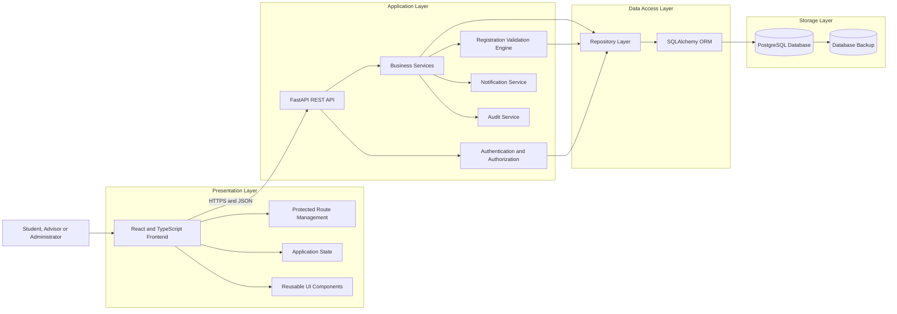
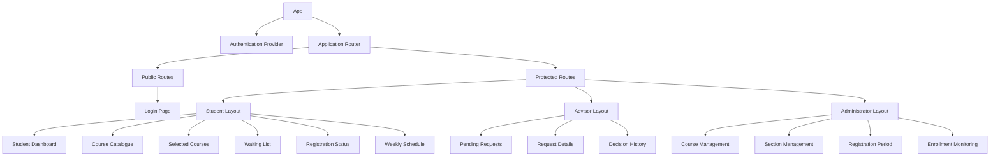
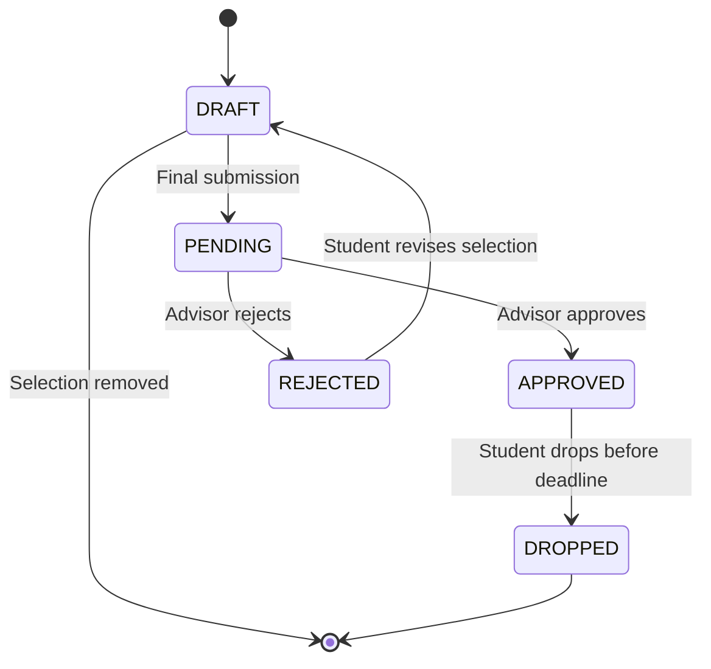
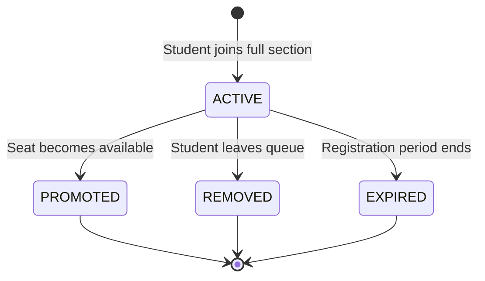
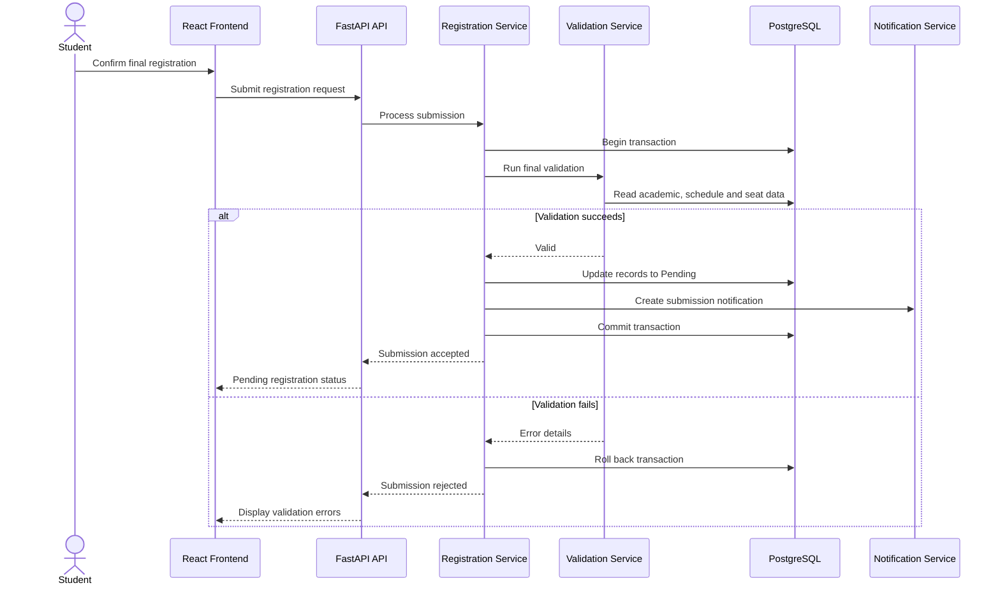
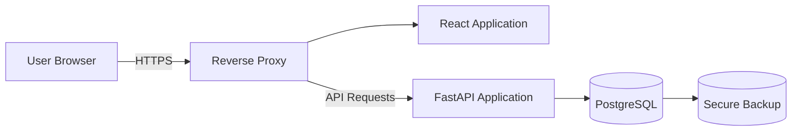

# CoursePilot Technical Design Document

## 1. Document Information

| Item           | Details                   |
| -------------- | ------------------------- |
| Project Name   | CoursePilot               |
| Document Type  | Technical Design Document |
| Frontend       | React, TypeScript, Vite   |
| Backend        | FastAPI, Python           |
| Database       | PostgreSQL                |
| API Style      | REST                      |
| Authentication | JSON Web Token            |
| Status         | Proposed Design           |
| Version        | 1.0                       |

---

# 2. Introduction

## 2.1 Purpose

This Technical Design Document describes how CoursePilot will be implemented.

It translates the business requirements, product requirements, functional requirements, non-functional requirements, use cases, Data Flow Diagrams, and Entity Relationship Diagram into a practical software design.

The document defines:

* Overall system architecture
* Frontend and backend components
* Database interaction
* Authentication and authorization
* Registration validation
* Seat-allocation control
* Waiting-list processing
* Advisor approval
* Notifications
* Error handling
* Security
* Testing
* Deployment
* Performance and scalability

## 2.2 Scope

The technical design covers the first version of CoursePilot.

The system will support:

* Student authentication
* Course browsing and searching
* Course-section selection
* Seat-availability display
* Prerequisite validation
* Credit validation
* Schedule-conflict detection
* Waiting-list management
* Final registration submission
* Advisor approval and rejection
* Registration-status tracking
* Approved schedule viewing
* Course and section administration
* User and role management
* Notifications and audit logging

## 2.3 Related Documents

This document should be read with:

* `01-project-overview.md`
* `08-prd.md`
* `13-functional-requirements.md`
* `14-non-functional-requirements.md`
* `15-use-cases.md`
* `16-dfd.md`
* `17-srs.md`
* `18-erd.md`
* `19-system-design.md`
* `21-database-design.md`
* `22-api-design.md`

---

# 3. Design Goals

The CoursePilot design has the following goals:

1. Prevent course-section over-enrollment.
2. provide accurate seat information.
3. Detect invalid registration before submission.
4. Clearly explain prerequisite and schedule errors.
5. Maintain fair waiting-list order.
6. Support secure role-based access.
7. Keep frontend, business logic, and database responsibilities separate.
8. Protect student and registration information.
9. Support future increases in users and course sections.
10. Make the application easy to test and maintain.

---

# 4. Technical Constraints

The system has the following technical constraints:

* The frontend must use React.
* The backend must use FastAPI.
* PostgreSQL must be used as the relational database.
* Frontend and backend communication must use REST APIs.
* API data must use JSON.
* The system must be managed through Git and GitHub.
* Sensitive configuration values must not be committed to the repository.
* The first version may use a single backend application instance.
* In-system notifications are sufficient for the first version.
* Course and academic records may initially be entered manually or loaded using seed data.

---

# 5. High-Level Architecture

CoursePilot follows a layered three-tier architecture.



---

# 6. Architectural Layers

## 6.1 Presentation Layer

The presentation layer is responsible for:

* Displaying application pages
* Collecting user input
* Displaying loading and error states
* Managing selected courses temporarily
* Showing registration status
* Rendering weekly schedules
* Calling backend APIs
* Protecting frontend routes according to user role

The presentation layer must not directly access PostgreSQL.

## 6.2 API Layer

The API layer is responsible for:

* Receiving HTTP requests
* Validating request formats
* Identifying authenticated users
* Checking role permissions
* Calling business services
* Formatting API responses
* Returning suitable HTTP status codes

API route handlers should remain small and should not contain complex business rules.

## 6.3 Service Layer

The service layer implements CoursePilot business rules.

It is responsible for:

* Course selection
* Prerequisite validation
* Credit calculation
* Schedule-conflict detection
* Seat checking
* Waiting-list processing
* Final submission
* Advisor approval
* Course dropping
* Notification generation
* Audit recording

## 6.4 Repository Layer

The repository layer is responsible for database operations.

It provides reusable functions for:

* Retrieving users
* Searching courses
* Retrieving course sections
* Reading completed courses
* Creating registration records
* Updating statuses
* Creating waitlist entries
* Retrieving waiting-list order
* Writing notifications
* Writing audit logs

## 6.5 Database Layer

PostgreSQL is the authoritative data source for:

* User accounts
* Courses
* Sections
* Seat capacity
* Academic records
* Registrations
* Waiting-list records
* Advisor decisions
* Notifications
* Audit logs

---

# 7. Frontend Technical Design

## 7.1 Main Frontend Modules

| Module             | Responsibility                                        |
| ------------------ | ----------------------------------------------------- |
| Authentication     | Login, logout, token handling and current-user state  |
| Course Catalogue   | Course searching, filtering and course-detail display |
| Course Selection   | Selected-course list and removal                      |
| Validation Display | Prerequisite, conflict, credit and seat messages      |
| Registration       | Summary, final submission and status tracking         |
| Waitlist           | Join, leave, position and status display              |
| Schedule           | Approved-course list and weekly timetable             |
| Advisor Portal     | Pending requests, details and decisions               |
| Administration     | Course, section, prerequisite and capacity management |
| Notifications      | Notification list and read status                     |

## 7.2 Frontend Component Hierarchy



## 7.3 Frontend State

The frontend should maintain:

### Authentication State

* Current user
* User role
* Authentication status
* Access token
* Token expiration

### Registration State

* Selected courses
* Selected credits
* Validation results
* Registration summary
* Submission status

### Interface State

* Search text
* Active filters
* Loading status
* Error messages
* Confirmation dialogs
* Notification count

## 7.4 API Communication

A centralized API client should:

* Store the base API URL
* Add authentication headers
* Convert request bodies to JSON
* Handle common errors
* Detect expired authentication
* Redirect unauthorized users
* Return typed response objects

## 7.5 Frontend Validation

Frontend validation may check:

* Empty required fields
* Invalid form formats
* Missing rejection reason
* Invalid capacity input
* Invalid schedule time input

Business-critical validation must also occur in the backend.

The frontend must never be treated as the final authority for:

* Seat availability
* Prerequisites
* Credit limits
* Schedule conflicts
* User permissions

---

# 8. Backend Technical Design

## 8.1 Backend Modules

| Module                 | Responsibility                                                 |
| ---------------------- | -------------------------------------------------------------- |
| Authentication Service | Credential checking, token creation and current-user retrieval |
| User Service           | User account and role management                               |
| Course Service         | Course search, filters and details                             |
| Section Service        | Section, instructor, room, schedule and capacity management    |
| Registration Service   | Selection, submission, status and course dropping              |
| Validation Service     | Prerequisite, credit, conflict, duplicate and seat validation  |
| Waitlist Service       | Queue entry, ordering, removal and promotion                   |
| Advisor Service        | Pending requests, approval, rejection and comments             |
| Schedule Service       | Student schedule and timetable generation                      |
| Notification Service   | In-system notification creation and retrieval                  |
| Audit Service          | Important activity recording                                   |

## 8.2 Dependency Direction

The expected dependency direction is:

```text
API Route
    ↓
Service
    ↓
Repository
    ↓
SQLAlchemy
    ↓
PostgreSQL
```

A repository should not call an API route.

A database model should not contain frontend logic.

A frontend component should not contain database rules.

---

# 9. Authentication Design

## 9.1 Login Process

1. The user submits an email or university identifier and password.
2. The backend retrieves the user account.
3. The password is compared with the stored password hash.
4. The account status is checked.
5. A JWT access token is generated.
6. The user profile and token are returned.
7. The frontend opens the correct role-based dashboard.

## 9.2 JWT Contents

The token may contain:

```json
{
  "sub": "user-uuid",
  "role": "student",
  "exp": 1781726400
}
```

## 9.3 Authorization

Protected endpoints must validate:

* Token existence
* Token signature
* Token expiration
* Account status
* Required user role
* Resource ownership

For example, a student may only access registrations belonging to that student.

## 9.4 Password Storage

Passwords must be:

* Hashed using Argon2 or bcrypt
* Salted by the password-hashing library
* Excluded from API responses
* Excluded from application logs

---

# 10. Course Browsing Design

The course catalogue should support:

* Pagination
* Search by course code
* Search by title
* Department filtering
* Course-level filtering
* Mandatory-course filtering
* Seat-availability filtering
* Semester filtering

A course-section response should include:

* Course information
* Section number
* Instructor
* Schedule entries
* Room
* Capacity
* Approved registration count
* Available seats
* Prerequisites
* Mandatory status

Available seats should be calculated from current database records.

---

# 11. Registration Domain Design

## 11.1 Registration Statuses

The system supports:

* `DRAFT`
* `PENDING`
* `APPROVED`
* `REJECTED`
* `DROPPED`

Waiting-list status should be maintained separately.

## 11.2 Registration Status Transitions



## 11.3 Allowed Transitions

| Current Status | Allowed Next Status  |
| -------------- | -------------------- |
| Draft          | Pending              |
| Pending        | Approved or Rejected |
| Rejected       | Draft                |
| Approved       | Dropped              |
| Dropped        | No active transition |

The backend must reject unsupported status transitions.

---

# 12. Registration Validation Engine

## 12.1 Validation Order

The validation engine should perform checks in the following order:

1. User authorization
2. Registration-period validation
3. Course and section existence
4. Duplicate-selection validation
5. Previously completed-course validation
6. Prerequisite validation
7. Schedule-conflict validation
8. Credit calculation
9. Credit-limit validation
10. Seat-availability validation

## 12.2 Selection Validation

During course selection, the system should immediately check:

* Duplicate section
* Completed course
* Missing prerequisite
* Schedule conflict
* Section availability

Credit totals should update after a valid selection.

## 12.3 Final Validation

All rules must be checked again during final submission.

This is necessary because:

* Seats may have changed.
* Registration may have closed.
* Section information may have changed.
* Another registration may have been approved.
* Student selections may have changed.

## 12.4 Validation Result Structure

```json
{
  "valid": false,
  "errors": [
    {
      "code": "MISSING_PREREQUISITE",
      "message": "CSE 201 must be completed before registering for CSE 301.",
      "section_id": "section-uuid",
      "details": {
        "required_course_code": "CSE 201"
      }
    }
  ]
}
```

---

# 13. Prerequisite Validation Algorithm

## 13.1 Input

* Student identifier
* Selected course identifier

## 13.2 Data Required

* Course prerequisite records
* Student completed-course records
* Minimum required grade, when configured

## 13.3 Algorithm

```text
function validatePrerequisites(studentId, courseId):
    prerequisites = getPrerequisites(courseId)

    if prerequisites is empty:
        return valid

    completedCourses = getCompletedCourses(studentId)
    missingPrerequisites = []

    for prerequisite in prerequisites:
        matchingCourse = find completed course

        if matchingCourse does not exist:
            add prerequisite to missingPrerequisites
        else if minimum grade is required:
            if completed grade does not satisfy requirement:
                add prerequisite to missingPrerequisites

    if missingPrerequisites is empty:
        return valid

    return invalid with missingPrerequisites
```

---

# 14. Schedule-Conflict Design

## 14.1 Conflict Condition

Two classes conflict when:

```text
same day
AND new start time < existing end time
AND new end time > existing start time
```

## 14.2 Compared Registrations

The new section should be compared against:

* Selected draft registrations
* Pending registrations
* Approved registrations

Rejected and dropped registrations should not block selection.

## 14.3 Multiple Meeting Times

A section may have multiple schedule records.

Each schedule record of the new section must be compared with every active schedule record already belonging to the student.

## 14.4 Conflict Response

The response should include:

* New course code
* New section
* Conflicting course code
* Conflicting section
* Day
* Start time
* End time

---

# 15. Credit Validation Design

## 15.1 Credit Calculation

```text
Total Credits =
Sum of credit values for active selected registrations
```

## 15.2 Credit Sources

Credit limits may be determined from:

1. Student-specific approved exception
2. Active registration period
3. Academic program default

The most specific applicable setting should be used.

## 15.3 Validation Behavior

During course selection:

* The current total is displayed.
* A warning may be displayed when the total exceeds the normal limit.

During final submission:

* A total below the minimum blocks submission.
* A total above the maximum blocks submission.

---

# 16. Seat-Allocation Design

## 16.1 Available Seat Formula

```text
Available Seats =
Section Capacity − Approved or Reserved Seat Count
```

## 16.2 Displayed Seat Count

The displayed seat count is informational.

The backend must not assume that an earlier displayed value remains correct during final confirmation.

## 16.3 Concurrency Control

To allocate a limited seat safely:

1. Start a database transaction.
2. Lock the course-section row.
3. Recalculate the active seat count.
4. Compare the count with section capacity.
5. Reserve or approve the seat when capacity exists.
6. Save the registration update.
7. Commit the transaction.
8. Roll back when capacity is unavailable.

A PostgreSQL row-level lock may be used.

```sql
SELECT id, seat_capacity
FROM course_sections
WHERE id = :section_id
FOR UPDATE;
```

## 16.4 Over-Enrollment Prevention

The system must prevent:

```text
approved_or_reserved_count > seat_capacity
```

Backend validation and database transactions must both support this rule.

---

# 17. Waiting-List Design

## 17.1 Waiting-List Statuses

The system supports:

* `ACTIVE`
* `PROMOTED`
* `REMOVED`
* `EXPIRED`

## 17.2 Waiting-List State Changes



## 17.3 Queue Ordering

Active entries should be ordered by:

```text
joined_at ASC, id ASC
```

## 17.4 Position Calculation

Waiting-list position should be calculated dynamically.

```text
Position =
Number of active entries ahead of the student + 1
```

The position should not be permanently stored because it changes when users join, leave, expire, or are promoted.

## 17.5 Join Validation

Before creating an entry, the system must check:

* The section is full.
* Registration is open.
* The student is not already registered.
* The student is not already waitlisted.
* Prerequisites are satisfied.
* No schedule conflict exists.

## 17.6 Promotion Algorithm

```text
function processWaitlist(sectionId):
    begin transaction
    lock section

    availableSeats = calculateAvailableSeats(sectionId)

    while availableSeats > 0:
        entries = getActiveEntriesOrderedByJoinedTime(sectionId)

        if entries is empty:
            break

        promoted = false

        for entry in entries:
            result = revalidateStudent(entry.studentId, sectionId)

            if result is valid:
                create or update registration
                mark entry as PROMOTED
                create notification
                write audit log
                availableSeats = availableSeats - 1
                promoted = true
                break
            else:
                mark or flag invalid entry according to policy

        if promoted is false:
            break

    commit transaction
```

---

# 18. Final Registration Submission

## 18.1 Submission Process



## 18.2 Submission Result

A successful submission should:

* Change selected registration records to Pending.
* Record the submission time.
* Associate the request with the student.
* Make the request visible to the assigned advisor.
* Create a student notification.
* Create an audit record.

---

# 19. Advisor Decision Design

## 19.1 Advisor Access

The advisor may view requests only for assigned students unless broader administrative permission exists.

## 19.2 Approval

Approval should:

1. Recheck request status.
2. Revalidate seat availability when necessary.
3. Lock affected section rows.
4. Update status to Approved.
5. Record the advisor and review time.
6. Create a student notification.
7. Write an audit record.

## 19.3 Rejection

Rejection should:

1. Require a reason.
2. Update status to Rejected.
3. Store the advisor comment.
4. Record the advisor and review time.
5. Release any reserved seat.
6. Process the waiting list when a seat becomes available.
7. Notify the student.
8. Write an audit record.

---

# 20. Course-Drop Design

A student may drop a course when:

* The registration is Approved.
* The drop deadline has not passed.
* The user owns the registration.

The drop process should:

1. Begin a transaction.
2. Lock the registration and section.
3. Validate the drop deadline.
4. Change the registration status to Dropped.
5. Release the seat.
6. Process the waiting list.
7. Update the student's schedule.
8. Create a notification.
9. Write an audit log.
10. Commit the transaction.

---

# 21. Notification Design

## 21.1 Notification Types

* `REGISTRATION_SUBMITTED`
* `REGISTRATION_APPROVED`
* `REGISTRATION_REJECTED`
* `WAITLIST_JOINED`
* `WAITLIST_PROMOTED`
* `WAITLIST_REMOVED`
* `COURSE_DROPPED`
* `REGISTRATION_PERIOD_OPENED`
* `REGISTRATION_PERIOD_CLOSED`

## 21.2 Notification Data

Each notification should contain:

* Recipient user ID
* Notification type
* Title
* Message
* Read status
* Creation time
* Optional related entity ID

## 21.3 Initial Delivery Method

The first version will use in-system notifications.

Email and SMS may be added later.

---

# 22. Audit Design

Audit records should be created for:

* Registration submission
* Advisor approval
* Advisor rejection
* Course drop
* Waiting-list promotion
* Course creation
* Section creation
* Capacity update
* Schedule update
* Prerequisite update
* User-role update
* Account activation or deactivation

Each audit record should contain:

* Acting user ID
* Action type
* Entity type
* Entity ID
* Action details
* Timestamp

Normal users must not be allowed to edit audit records.

---

# 23. Database Design Principles

The database design must use:

* Primary keys
* Foreign keys
* Unique constraints
* Check constraints
* Indexes
* Transactions
* Timestamps
* Controlled status values

Important constraints include:

```text
Unique user email
Unique student number
Unique course code
Unique course section per semester
Unique student registration per section
Unique student waitlist entry per section
Positive section capacity
End time later than start time
Course cannot be its own prerequisite
```

The complete table-level design is provided in `21-database-design.md`.

---

# 24. REST API Design Principles

The REST API should use:

* Resource-oriented URLs
* Standard HTTP methods
* Standard status codes
* JSON request and response bodies
* Pagination for lists
* Query parameters for search and filters
* JWT authentication
* Role-based endpoint protection
* Consistent success and error formats

Example resource groups include:

```text
/auth
/users
/courses
/sections
/registrations
/waitlists
/advisor
/admin
/notifications
```

The complete endpoint design is provided in `22-api-design.md`.

---

# 25. Error-Handling Design

## 25.1 Standard Error Response

```json
{
  "success": false,
  "error": {
    "code": "SECTION_FULL",
    "message": "The selected course section is full.",
    "details": {
      "section_id": "section-uuid",
      "waitlist_available": true
    }
  }
}
```

## 25.2 Error Categories

| Category       | Example                                    |
| -------------- | ------------------------------------------ |
| Authentication | Invalid credentials                        |
| Authorization  | User lacks required role                   |
| Validation     | Missing prerequisite                       |
| Conflict       | Duplicate registration or full section     |
| Not Found      | Course section does not exist              |
| Business Rule  | Registration period is closed              |
| Server Error   | Unexpected database or application failure |

## 25.3 HTTP Status Codes

| Status Code | Usage                                      |
| ----------- | ------------------------------------------ |
| 200         | Successful retrieval or update             |
| 201         | Resource successfully created              |
| 204         | Successful operation without response body |
| 400         | Invalid request                            |
| 401         | Authentication required or invalid         |
| 403         | Permission denied                          |
| 404         | Resource not found                         |
| 409         | Resource or business-state conflict        |
| 422         | Validation failure                         |
| 500         | Unexpected server error                    |

---

# 26. Security Design

## 26.1 Authentication Security

* Passwords must be securely hashed.
* Tokens must have expiration times.
* Inactive users must be denied access.
* Protected routes must require valid tokens.

## 26.2 Authorization Security

* Backend endpoints must check user roles.
* Students may only access their own records.
* Advisors may only review assigned students.
* Administrative actions must require an administrative role.

## 26.3 Input Security

* Pydantic must validate request data.
* SQLAlchemy or parameterized SQL must be used.
* Untrusted input must not be placed directly into queries.
* Capacity and schedule values must be validated.

## 26.4 Configuration Security

Secrets must be stored in environment variables.

Examples include:

```text
DATABASE_URL
JWT_SECRET_KEY
JWT_ALGORITHM
ACCESS_TOKEN_EXPIRE_MINUTES
```

The `.env` file must not be committed to GitHub.

## 26.5 Communication Security

Production communication should use HTTPS.

---

# 27. Performance Design

The following techniques should support acceptable performance:

* Database indexes
* Pagination
* Selective column retrieval
* Query optimization
* Database connection pooling
* Avoiding repeated queries
* Caching stable course information when appropriate
* Avoiding unnecessary frontend re-rendering

Frequently indexed fields may include:

* User email
* Student number
* Course code
* Section semester ID
* Registration student ID
* Registration section ID
* Registration status
* Waitlist section ID
* Waitlist status
* Waitlist joining time

---

# 28. Logging and Monitoring

Application logs should contain:

* Timestamp
* Log level
* Request path
* HTTP method
* Response status
* Request identifier
* Error message

Logs must not contain:

* Plain-text passwords
* Password hashes
* Access tokens
* Database passwords
* Secret keys

Important metrics may include:

* API response time
* Login failures
* Registration failures
* Active users
* Section-full responses
* Waiting-list promotions
* Database errors

---

# 29. Deployment Design

## 29.1 Deployment Components



## 29.2 Containerized Deployment

A Docker Compose environment may contain:

* Frontend container
* Backend container
* PostgreSQL container
* Reverse proxy container

## 29.3 Environments

The project should support:

* Development
* Testing
* Production

Each environment should use separate configuration values.

---

# 30. Testing Design

## 30.1 Unit Tests

Unit tests should cover:

* Password verification
* Prerequisite validation
* Schedule-conflict detection
* Credit calculation
* Credit-limit validation
* Seat calculation
* Waiting-list ordering
* Registration status transitions

## 30.2 Integration Tests

Integration tests should cover:

* Login with database records
* Course searching
* Registration submission
* Advisor approval
* Advisor rejection
* Course dropping
* Waiting-list promotion
* Role-based authorization

## 30.3 Concurrency Tests

Concurrency tests should verify:

* Two students cannot receive the same final seat.
* Approved registration does not exceed capacity.
* Waiting-list promotion remains correctly ordered.
* Duplicate registration is prevented.

## 30.4 Frontend Tests

Frontend tests should cover:

* Login form
* Protected routes
* Course filtering
* Credit-total updates
* Conflict-message display
* Waiting-list position display
* Advisor-decision form
* Weekly schedule rendering

## 30.5 End-to-End Tests

A complete student flow should test:

1. Student login
2. Course search
3. Course selection
4. Final validation
5. Registration submission
6. Advisor approval
7. Student status update
8. Weekly schedule display

---

# 31. Requirement-to-Component Traceability

| Requirement Area      | Main Technical Components                                     |
| --------------------- | ------------------------------------------------------------- |
| Authentication        | Auth API, Authentication Service, User Repository             |
| Course browsing       | Course API, Course Service, Course Repository                 |
| Seat availability     | Section Service, Registration Repository, PostgreSQL          |
| Prerequisites         | Validation Service, Prerequisite Repository, Academic Records |
| Credit validation     | Validation Service, Course Repository, Registration Service   |
| Schedule conflicts    | Validation Service, Schedule Repository                       |
| Waiting list          | Waitlist API, Waitlist Service, Waitlist Repository           |
| Final submission      | Registration API, Registration Service, Validation Service    |
| Advisor approval      | Advisor API, Advisor Service, Registration Repository         |
| Student timetable     | Schedule API, Schedule Service                                |
| Notifications         | Notification Service and Notification Repository              |
| Audit logging         | Audit Service and Audit Log Repository                        |
| Course administration | Administration API, Course and Section Services               |
| User administration   | User API, User Service and Authorization Service              |

---

# 32. Technical Risks and Mitigation

| Risk                             | Impact                                    | Mitigation                                     |
| -------------------------------- | ----------------------------------------- | ---------------------------------------------- |
| Outdated seat display            | Student may select an unavailable section | Revalidate seats during confirmation           |
| Concurrent final-seat requests   | Section may become over-enrolled          | Use row locking and database transactions      |
| Incorrect waiting-list order     | Unfair seat allocation                    | Order by server-generated joining timestamps   |
| Missing academic data            | Incorrect prerequisite result             | Validate and synchronize academic records      |
| Unauthorized access              | Student data exposure                     | Enforce backend role and ownership checks      |
| Complex business logic in routes | Difficult maintenance                     | Use service and repository layers              |
| Slow course search               | Poor registration experience              | Add indexes, filters and pagination            |
| Failed registration transaction  | Inconsistent data                         | Roll back incomplete operations                |
| Token theft                      | Unauthorized access                       | Use HTTPS, token expiration and secure storage |
| Invalid administrator input      | Incorrect schedules or capacities         | Use frontend and backend validation            |

---

# 33. Future Technical Enhancements

Possible technical improvements include:

* Refresh-token authentication
* Redis caching
* Background task queue
* Email and SMS notifications
* Automated university-system synchronization
* Centralized monitoring
* Load balancing
* Multiple backend instances
* Cloud database deployment
* Native mobile application
* Degree-audit integration
* Recommendation engine
* Analytics dashboard

---

# 34. Conclusion

The CoursePilot Technical Design Document defines how the proposed requirements will be implemented using React, FastAPI, PostgreSQL, REST APIs, JWT authentication, SQLAlchemy, and a layered architecture.

The design addresses the most important technical challenges of the project:

* Accurate seat information
* Concurrent registration attempts
* Prerequisite checking
* Credit-limit validation
* Schedule-conflict prevention
* Fair waiting-list processing
* Advisor approval
* Role-based security
* Data consistency
* Error handling
* Testing and deployment

This document provides the technical foundation for the detailed database and API designs.
